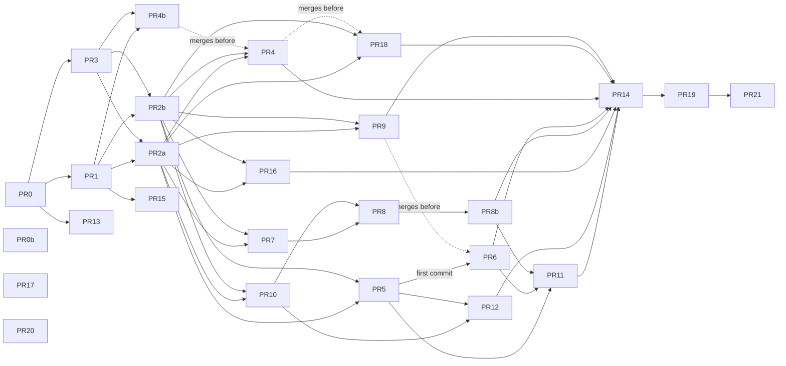

# Structural Refactor

> **Status: agreed, not started.** This is the plan for one consolidation pass over the finished build, to prepare the codebase for adding telemetry and metrics. It comes from a structural audit made on 2026-09-16 (six area leads, each backed by per-file deep dives).
>
> The pass has four aims:
> - make each concept live in one place;
> - make every layer follow the same layout rule;
> - put the finished shape under lint, so it does not drift back;
> - leave the seams that telemetry will fill in place.
>
> This document replaces [[4-implementation-plan#File ownership]] as the reference for who touches what; see §2.

## 1. Ground rules for this pass

1. **Nothing telemetry-related is removed.** The following all stay:
   - `packages/telemetry`, its no-op functions and its event types;
   - the `pino` and `@fastify/otel` dependencies in `apps/backend`;
   - every `traceId: null` placeholder.

   Where this pass confines something to one module (`fetch`, `process.env`, logging), the reason is to give telemetry a single place to hook in later.
2. **Each PR lands the lint rule that protects its outcome** (§4). The rule and its `tests/lint-*.test.ts` cases go in the same PR as the change they guard, and the PR description lists them.
3. **Behaviour does not change unless this plan says it does.** Where a PR changes behaviour, the plan says so and the PR description repeats it.
4. **UI PRs carry screenshots**, per `AGENTS.md`.
5. **Test moves update [[8-testing#7. Test case enumeration]] in the same PR.** That ledger cites tests by path.
6. **Decisions Log rows are added or amended in the PR that makes the decision real** (§5).
7. Every PR runs `lint`, `typecheck`, `npm test` and `build`, and CI must be green.

## 2. File ownership during the pass

The track-based ownership table in [[4-implementation-plan#File ownership]] is **deprecated**: every track has merged, and it was still shaping the layout. PR 20 marks it deprecated.

For this pass, each PR in §3 names the paths it owns. Two PRs may run in parallel only if their owned paths do not overlap, or if the plan names the order in which they rebase; §3.1 lists the result. The old "Contended" files are ordinary files now; the PR that changes one says so in its description.

## 3. The PRs

PRs are numbered by phase, not by execution order; §3.1 gives the order and what can run at the same time, and each PR repeats its own dependencies. Effort estimates: S is under half a day, M is one to two days, L is more.

### 3.1 Order and parallelism

Two PRs can run at the same time when the files they own don't overlap. The waves below follow from the "Owns" lines. Every PR in a wave can start once the waves before it have merged, except where an arrow in the graph says otherwise.

| Wave | PRs, run in parallel | Waits for |
| --- | --- | --- |
| 0 | PR 0 (lint harness), PR 0b (the four rules PR 0 left unowned), PR 17 (compose), PR 20 (ownership table) | nothing |
| 1 | PR 1 (request helpers, problem parser), PR 3 (`db/execution`), PR 13 (tsconfig presets) | PR 0 |
| 2 | PR 2a (shared vocabulary), PR 2b (test support), PR 4b (route cleanup), PR 15 (root scripts) | PR 1 and PR 3 |
| 3 | PR 4 (database cleanup), PR 5 → PR 6 (admin), PR 7 → PR 8 → PR 8b (respondent), PR 9 (primitives), PR 10 (questionnaire index), PR 16 (e2e), PR 18 (comments) | PR 2a and PR 2b |
| 4 | PR 11 (icons), PR 12 (preview panel) | PR 5, PR 6, PR 8b, PR 10 |
| 5 | PR 14 (import extensions), then PR 19 (`AGENTS.md`) | everything above; PR 14 runs alone |
| 6 | PR 21 (`noUncheckedIndexedAccess`) | everything |

Wave 3 is the widest: up to eight branches at once (PR 4, PR 5, PR 6, one respondent PR, PR 9, PR 10, PR 16 and PR 18), with PR 6 starting from PR 5's first commit and the respondent PRs in a chain.

Dotted arrows mean the order to merge in; they don't block starting work.

**Files that many PRs touch.** These cause small, predictable rebase conflicts even between PRs marked parallel:

- **`eslint.config.mjs`.** Most PRs add a rule to it. After PR 0, each rule is its own named block appended to the list, so a conflict means keeping both blocks.
  After PR 0b, `restrict()` also carries L7's library patterns, so a block scoped inside `apps/admin`, `apps/respondent` or `packages/ui/src/primitives` builds its patterns with `restrictOutside(<that home>, …)`; `restrict()` there would ban the home its own libraries live in.
- **The Decisions Log in [[2-design-doc#17. Decisions Log]].** New rows are numbered in merge order (§5), so the PR that merges second renumbers its row.
- **[[8-testing#7. Test case enumeration]].** Rows are grouped per workspace, so parallel PRs edit different parts of the table.

### Phase A — Foundations

#### PR 0 — ESLint config structure and a shared lint test harness · S

> **Depends on:** nothing. **Can run alongside:** PR 17, PR 20.

This lands first, because every later PR adds lint rules and lint tests.

- Build `telemetryOnly` and the base double-assertion patterns into the `restrict()` and `syntax()` helpers automatically. A new block then cannot drop an inherited pattern by accident, and the three hand-built cumulative arrays go away. Each rule becomes its own named block appended to the list, so PRs that add rules in parallel conflict only on adjacent lines.
- Cut the 15-line header comment in `eslint.config.mjs` to a pointer at this document and [[7-application-boundary]]. The same applies to the comment above `filesThatMayConstructConnections`: it moves into the lint test description.
- Add `playwright-report`, `test-results` and `.stacks` to `ignores`.
- Extract `tests/lint-harness.ts` with one helper signature, `lintAs(filePath, code)`. All five `tests/lint-*.test.ts` files use it.

Owns: `eslint.config.mjs`, `tests/**`.

#### PR 0b — The four lint rules PR 0 left unowned · S

> **Depends on:** nothing. **Can run alongside:** anything.

PR 0 merged without the four rules §4.1 assigned to it. All four measure 0 violations, so this lands them and corrects the table.

- **L7** appends the library split to the patterns `restrict()` inherits, and gives `apps/admin`, `apps/respondent` and `packages/ui/src/primitives` a block each carrying every library but its own.
- **L17** covers the bare global and the `window.` and `globalThis.` member forms, because the seam itself reads `globalThis.localStorage` and `no-restricted-globals` alone would not see a copy of that line.
- **L19** allowlists five entry points by exact path, not by directory.
- **L20** appends the `ExportDefaultDeclaration` selector to the ones `syntax()` inherits, and exempts `*.config.*` and the three framework `globalSetup`/`globalTeardown` files. Flat config replaces a rule's options rather than merging them, so an exempting block restates every other selector that applies to the files it names: the backend's config files keep the raw-SQL and connection-construction warnings, and the backend harness's `globalSetup` keeps raw SQL while keeping the connection-construction exemption it already had.
- Amend the §4.1 rows whose wording is wider than the rule that ships (L17, L19, L20), and move all four to this PR.

Lint rules: L7, L17, L19 and L20.

Owns: the four blocks it appends to `eslint.config.mjs`, `tests/lint-{library-split,storage,console,default-exports}.test.ts`, this document.

#### PR 1 — Shared request helpers, one problem parser, and `pretest` · M

> **Depends on:** PR 0. **Can run alongside:** PR 3, PR 13, PR 17, PR 20.

This is items 1 and 2 of the audit's first tier.

- **Request helpers.** Add `packages/shared/src/api/request.ts` with `routePath`, `routeSearch`, `successSchemaOf` and `RequestParts<R>`. It must be transport-free: shared builds with `types: []`, so `fetch`, `Headers` and `URLSearchParams` are not available there.
- **Route types and ETag check.** Move the route-success helpers into `packages/shared/src/api/route.ts`: `SuccessStatus` comes from `apps/backend/src/http/routes.ts`, the only one of them that lived there, and `RouteWith`/`SuccessBody` come from admin's `src/api/client.ts`. Add `isDraftEtagFor` to `packages/shared/src/api/etag.ts`.
- **Problem parser.** Add `problemFromWire(wire)` to `packages/shared/src/problems.ts`, driven by a value-level extension table, reading against a permissive envelope so an unknown code is distinguishable from a malformed body. Export the code guards and one item-error schema factory. **Amended:** the plan called for an `{ unknownCodes: "drop" | "reject" }` policy, on the premise that admin drops unknown codes today. It does not — `apps/admin/src/api/problem-error.ts` and `apps/respondent/src/api/request.ts` both opened with the same `Value.Check(ProblemDetails, body)` and both rejected. The parser therefore has one behaviour, refusing a body it does not fully understand, which is what both consumers already did ([[2-design-doc#17. Decisions Log]] #81).
- **Consumers.** Admin (`src/api/client.ts`, `src/api/problem-error.ts`), respondent (`src/api/request.ts`, `src/api/problems.ts`) and e2e (`fixtures/api/api-exchange.ts`, `specs/tier-3/support/authoring.ts`) switch to the shared helpers. Each consumer keeps only its policy: admin throws `ProblemError` and checks the ETag, respondent returns an outcome union, e2e sends through Playwright.
- **Admin cleanup.** Delete admin's builders for the execution-only slugs.
- **Admin type tests.** The `@ts-expect-error` type tests in admin must still fail to compile without the directive; they are the regression net.
- **`pretest`.** Add a root `"pretest": "npm run build -w packages/shared"`, so `npm test` works on a fresh clone.

Lint rules: L6 and L10.

Owns: `packages/shared/src/{api,problems.ts}`, `apps/admin/src/api/{client,problem-error}.ts`, `apps/respondent/src/api/**`, `e2e/fixtures/api/**`, `e2e/specs/tier-3/support/authoring.ts`, root `package.json` (the `pretest` line only).

Follow-up: [gh#80](https://github.com/kenziesimpson/questionnaire-platform/issues/80), which adds per-route problem lists to `defineRoute`. It comes after this PR.

#### PR 2 — Shared domain vocabulary and one home for frontend test support · M

> **Depends on:** PR 1, PR 3. **Can run alongside:** PR 4b, PR 15, PR 13.

This is items 3 and 4 of the audit's first tier. It branches after PR 1 merges, because both edit `packages/shared/src/index.ts`.

**Amended:** PR 2 shipped as two PRs, so its halves could run in parallel. **PR 2a** owns **Domain vocabulary** and **Shared package surface** below, with L8, L9 and L15. **PR 2b** owns **Test support**, with L11. Wave 3 waits for both (§3.1), and a later PR that depends on "PR 2" depends on both.

**Domain vocabulary**
- Export the following from `packages/shared/src/domain/`: `QuestionOf`, `OTHER_OPTION_ID`, `optionIdsOf`, `freeformOptionOf`, `conditionsOf`, `referencedOptionIds`, `OPERATORS_BY_TYPE`, `isChoiceQuestion`, `draftItemOf`, `draftForValidation` and `questionInputOf`.
- Delete every local copy of those helpers: 4 of `QuestionOf`, 3 of `OTHER_OPTION_ID`, 5 of the `Item`→`DraftItem` projection, 3 of the `QuestionContent`→`QuestionInput` strip, and so on.
- Use one definition of the "other" option everywhere: `id === OTHER_OPTION_ID && freeform`. Today it is detected three different ways, so this is a small behaviour change, recorded as a new Decisions Log row (§5).
- **Amended (PR 2a):** admin's `questionInputOf` was not a copy: it builds a `QuestionInput` from the editor's form, not from `QuestionContent`. It is renamed `questionInputFromForm` rather than deleted, because L9 reserves the name. `freeformOptionOf`, `OPERATORS_BY_TYPE` and `isChoiceQuestion` had no copies under those names; they replace inline spellings (`"options" in question`, admin's `OPERATORS` and `isChoice`, the renderer's `option.freeform`).

**Shared package surface**
- Move `strict` into `primitives.ts` and delete `domain/utils.ts`. Remove the 7 re-declarations of `strict`.
- Convert `packages/shared/src/index.ts` from `export *` to named exports, and stop exporting the roughly 30 names nothing imports.
- **Amended (PR 2a):** that includes the code guards (`is*Code`) and `ItemErrorOf`, which PR 1 exported; nothing outside the package imports them, and L10 bans hand-built guards anyway.
- Move the demo data to a `./demo` subpath export, including the seed's question keys and bank history, and the item and option ids that e2e re-types by hand.
- **Amended (PR 2a):** the e2e fixtures keep their `DEMO_*` names as aliases of the shared `INTAKE_*` constants, so no spec changes; folding the aliases away is PR 16's.
- Add an execution-route completeness test to match the existing definition-route one.

**Test support**
- Add `packages/ui/src/testing/`, exported as `@qp/ui/testing`, with three pieces:
  - the jsdom polyfills;
  - one axe runner with the shared rule config;
  - one fake-`fetch` server built on the PR 1 route helpers.
- Admin, respondent and ui import from it and delete their own copies.
- Add `apps/admin/_tests/support/` with `render-app.tsx`, `routes.ts`, `builders.ts` and `http.ts`. The general helpers in `_tests/screens/question-editor/harness.tsx`, which nine unrelated files import, move there. `fillJsdomLayoutGaps` moves into `_tests/setup.ts`.
- Align backend test support naming: `harness.ts` builds the app, `fixtures.ts` holds data and request helpers. Add `_tests/modules/definition/fixtures.ts`, and export the shared helpers once from `_tests/db/fixtures.ts`.

Lint rules: L8, L9 and L11. **Amended:** L15 too, which §4.1 assigns to PR 2; PR 2a lands L8, L9 and L15, and PR 2b lands L11.

Owns: `packages/shared/src/{index.ts,primitives.ts,domain,engine,demo}`, `packages/ui/src/testing/**`, `**/_tests/{setup,support,axe,fixtures,harness}*`, `apps/backend/src/db/seed/**`.

**Amended:** one Owns line per half.
- **Owns (2a):** `packages/shared/src/**`, `packages/shared/package.json` (the `./demo` export), `apps/backend/src/db/seed/**`, the local copies of the vocabulary wherever they sit, and every import of the demo names.
- **Owns (2b):** `packages/ui/src/testing/**` and its tests in `packages/ui/_tests/testing/**`; the `./testing` export and test-only dependencies in `packages/ui/package.json`, and `axe-core` in the admin and respondent manifests; `**/_tests/{setup,support,axe,fixtures,harness}*`; the fakes it replaced (`apps/admin/_tests/fake-definition-api.ts`, `apps/respondent/_tests/execution-server.ts`); the tests whose imports change as a result; `tests/lint-test-support.test.ts`; and `package-lock.json` for the dependency moves.
- The halves share test files, `eslint.config.mjs` and `docs/8-testing.md`. **PR 2a merges first; PR 2b rebases onto it** and keeps 2a's `@qp/shared/demo` imports and vocabulary imports in the shared test files.

### Phase B — Backend

#### PR 3 — `src/db/execution` · M

> **Depends on:** PR 0. **Can run alongside:** PR 1, PR 13, PR 17, PR 20.

Execution's persistence moves under `src/db`, which mirrors the definition side. The HTTP layer stays in the module.

- **Moves to `apps/backend/src/db/execution/`:** `published-definitions.ts`, and the queries and transaction code from `sessions.ts` and `submit.ts` (`lockSession`, `closesAtOf`, `persistResponses`, `sessionColumns`, `startSession`, `resumeSession`, `submitSession`).
- **Also moves:** `sessionView` and `receiptFor`. They are wire projections, which `src/db/definition` already owns for its own side.
- **Stays in `src/modules/execution/`:** `plugin.ts`, which holds the routes, `problemFor` and the `cache-control` hook.
- **Tests:** mirror the moves under `_tests/db/execution/` and update the paths in [[8-testing#7. Test case enumeration]].

Lint rules: L1, which extends the database boundary.

Owns: `apps/backend/src/{modules,db}/execution/**` and their `_tests` mirrors.

#### PR 4 — Database-layer cleanup · M

> **Depends on:** PR 2, PR 3; rebases onto PR 4b. **Can run alongside:** PR 5, PR 6, PR 7, PR 9, PR 10, PR 16, PR 18.

This PR follows PR 3 and covers `src/db/definition`.

**Split files that do two jobs**
- Add `questionnaire-version-rows.ts` for the open-draft access and the `isPublishedVersion*` / `publishedValue` helpers. After this, `versions.ts` is the read model only.
- Add `question-rows.ts` and move `archivedQuestionIds` into it.
- Split `questions.ts` into `questions.ts` (writes) and `question-reads.ts`. The reads delegate to `readQuestionVersions`, which removes the second copy of the column projection.

**Remove duplication**
- Merge the duplicated row helpers in `questions.ts` into `questionnaire-rows.ts`.
- Add a `withCurrentDraft` helper for the lock-then-precondition preamble that `drafts.ts` and `publish.ts` both repeat. It must keep `publish.ts`'s extra lock on the questionnaire row.
- Add one "row must exist" guard, replacing the three spellings in `readBack`, `publishedValue` and `lastEditedAt`.
- Fold the 6-line `read-back.ts` and the 8-line `draft-precondition.ts` into their callers. `DraftPrecondition` becomes a named export from `@qp/shared`.

**Move errors and remove redundant fields**
- Move `http/database-errors.ts` to `db/errors.ts` with one `SQLSTATE` table. The test harness and `modules/definition/errors.ts` import it.
- Remove the fields that only the seed or tests use from production outcome types: `draftVersionId` on `replaceDraft`, the duplicates on the publish outcome, and `draftVersionId`/`draftRevision` on `CreatedQuestionnaire`. The seed's hardcoded-id option ([[2-design-doc#17. Decisions Log]] #35) stays, renamed to say what it is for.
- Delete `RESPONSE_TYPE_VALUES`, which nothing uses, and stop exporting the other names nothing imports.

**Decide and document**
- Decide what happens to the `archivedQuestionIds` option on the shared `validateDraft`: `refusedItems` either uses it or it is deleted. Either way, the behaviour in #75 stays.
- Write down which test layer owns what in [[8-testing#2. Layers]]: repository tests own outcomes, locks and audit; route tests own status, problem type and headers. Then trim the scenarios both layers repeat.
- **Execution test support.** `apps/backend/_tests/db/execution/fixtures.ts` re-exports `useExecutionApp`, an app builder, because `db/execution` and `modules/execution` tests both need it and PR 2b's `harness.ts`/`fixtures.ts` split didn't cover execution's own layering. Decide where `useExecutionApp` belongs (its own `harness.ts`, or promoted elsewhere) and move it there.
- Unchanged: `traceId` stays on every command type (§1).

Owns: `apps/backend/src/db/**` except `schema.ts`, `client.ts` and the migrations.

#### PR 4b — Backend route and HTTP cleanup · S–M

> **Depends on:** PR 1, PR 3. **Can run alongside:** PR 2, PR 15; merges before PR 4.

This is its own PR, separate from the database cleanup in PR 4.

- Add `notFoundProblem` in `src/http/problems.ts`; the same problem is built 6 times today. Make `registerRoute` fill in `instance` from `request.url` by default. **Amended:** `sendProblem`, which every problem goes through, sets `instance` to the request URL, not `registerRoute`. Every problem body therefore carries it, including those from the error and not-found handlers, so handlers and mappers never pass it. `notFoundProblem()` takes no argument. This changes behaviour, which the user approved on review: the schema-validation `400`s (a missing `If-Match` among them), other framework `4xx`, the `500`, the malformed-URL `400` (which also changes from Fastify's own JSON body to a problem, through `frameworkErrors`), the question-rule and type-lock `400`s, the malformed-`If-Match` `400` and `PUT /draft`'s `422` gain an `instance`. The `500`'s `detail` stays the request id.
- Add a `definitionProblem(refusal, instance)` mapper in `src/modules/definition/problems.ts`, replacing four switches that have already drifted from each other. **Amended:** the mapper is `definitionProblem(refusal)`, because `sendProblem` supplies `instance`; execution's `problemFor(refusal)` drops the parameter too. The four were three `switch`es (`PUT /draft`, `POST /draft`, `POST /publish`) and the `if` chain in `POST /questions/:questionId/versions`. They had drifted in one place: `PUT /draft`'s `422 questionnaire/draft-invalid` left out the `instance` that `POST /publish`'s carried, which was a bug. The mapper also takes the not-found refusals of `setClosesAt` and `archiveQuestion`, so no definition route maps an outcome by hand.
- Make `draftPreconditionOf` return `DraftPrecondition | Problem`, and delete the exception class that is thrown and caught by `instanceof`.
- Move the publish route into `routes/drafts.ts`, and turn the route files into plain `register*Routes(scope, database)` functions.
- Split `http/problems.ts` into `problems.ts` and `validation.ts`, and add an `applyHttpDefaults(scope, errorHandler)` helper used by the root app and both modules.
- Rename `db/migrator.ts` to `db/migrations.ts`.
- Move `snapshotEtag` into `@qp/shared`.

### Phase C — Frontends (after PR 2)

#### PR 5 — Admin consolidation · M

> **Depends on:** PR 2. **Can run alongside:** PR 4, PR 6, PR 7, PR 9, PR 10, PR 16, PR 18.

- **Its first commit is the moves.** Create `src/lib/`, containing `dates.ts`, `question.ts`, `input-patterns.ts`, `counts.ts` and `generated-id.ts`. Move `src/screens/question-editor/**` to `src/features/question-editor/**`. PR 6 branches from this commit.
- **Shared vocabulary goes to `src/lib/`.** That covers `RESPONSE_TYPE_LABELS`, `DECIMAL_INPUT_PATTERN`, `lastEditedLabel`, `fullTimestamp`, `isArchived` and `sortByLatestEdit`. The three date formatters become one, with one locale.
- **Sortable lists.** Add `src/components/sortable-list.tsx` with a `useSortableList` hook and a `SortableRow` component. `draft-items.tsx` and `options-editor.tsx` use it. The screen-reader announcement strings must stay byte-identical, because tests assert them.
- **`options-editor.tsx` goes through `edits`.** Its three direct writes to form state are replaced by calls to `edits`.
- **Mutations:**
  - Every mutation hook moves under `src/api/mutations/`, including `use-save-question.ts`, `use-archive-question.ts` and the two mutations inline in dialogs.
  - Invalidation uses `queryKeys.*` everywhere.
  - Extract a pure `draft-write-ledger.ts` and an `api/draft-types.ts`.
  - Delete the queries and keys nothing uses, and stop exporting the four `client.ts` symbols nothing imports.
- **Shared components:**
  - `field.tsx` and `segmented-control.tsx` move to `src/components/`.
  - The dialogs use `InputField`.
  - Add `screen-header.tsx` and `query-state.tsx` (`LoadingLine`, `RetryNotice`).
  - The four hand-rolled pills use `Pill`.
- **Renames.**
  - Rename `version-preview/version-preview.tsx` to `preview-body.tsx`.
  - Move the `NumberedItem` type to the module that produces it.
- **Config residue.** Remove the unused `@/` alias from the Vite config, `tsconfig.json` and `components.json`.

Lint rules: L3 and L4.

Owns: `apps/admin/src/{lib,components,api,features}/**`, `draft-items.tsx`, `options-editor.tsx`, `version-preview/**`, `questionnaire-list/**`, `question-bank/**`.

#### PR 6 — Admin splits for testability · M

> **Depends on:** PR 5's first commit. **Can run alongside:** PR 4, PR 5, PR 7, PR 9, PR 10, PR 16, PR 18; rebases onto PR 9 (one import line).

This PR runs in parallel with PR 5, branching from PR 5's first commit.

- **`predicate-editor.tsx`** becomes a `predicate-editor/` directory:
  - `condition-row.tsx`, with a pure `stepCondition` function;
  - `choice-operand.tsx`, `number-operands.tsx` and `date-operands.tsx`.
  - Its pure helpers move into `conditions.ts`, which keeps only the operator algebra. The selectors move to `draft-selectors.ts`.
  - The `key` remount on `NumberInput` stays.
- **`draft-editor.tsx`** splits into:
  - `use-draft-editor.ts`, `draft-header.tsx` and `no-open-draft.tsx`;
  - a pure `publish-checks.ts`;
  - `item-dom.ts`, which owns the DOM-id contract.
  - A new `useQuestionnaireSummary(id)` hook goes in `src/api/`. What remains is a route component of about 120 lines.
- **`question-form.ts`** splits into `form-state.ts`, `form-edits.ts`, `form-serialize.ts` and a `use-question-form.ts` hook.
- **Tests.** The clamping cases move from the dialog's DOM tests down to unit tests. `draft-editor.test.tsx` splits along the new files.

Owns: `apps/admin/src/screens/draft-editor/{predicate-editor*,conditions.ts,draft-changes.ts}`, `apps/admin/src/screens/draft-editor.tsx`, `apps/admin/src/features/question-editor/{question-form*,question-editor-dialog*}`, and the matching `_tests`.

#### PR 7 — Split the respondent test file · M

> **Depends on:** PR 2. **Can run alongside:** PR 4, PR 5, PR 6, PR 9, PR 10, PR 16, PR 18.

- `_tests/app.test.tsx` (965 lines) is split up:
  - the request-sequencing blocks go to `_tests/session/respondent-session.test.ts`;
  - new files `_tests/screens/{questionnaire-screen,error-summary,receipt-screen,terminal-screens}.test.tsx`;
  - `app.test.tsx` keeps entry dispatch and one happy path.
- Each axe check folds into its behaviour test, as admin already does.
- `respondent-session.ts` takes both the API client and storage as injectable parameters, and the new session test uses them.
- Update 32 rows in [[8-testing#7. Test case enumeration]], and remove the stale row.

Owns: `apps/respondent/_tests/**`, `apps/respondent/src/session/respondent-session.ts`.

#### PR 8 — One source for the respondent's failure screen · M

> **Depends on:** PR 7, PR 10. **Can run alongside:** PR 4, PR 5, PR 6, PR 9, PR 16, PR 18.

This PR comes after PR 7, because it changes the same session file.

- Add a pure `viewOf(state)` selector in `src/session/respondent-view.ts`.
- `app.tsx` becomes one exhaustive `switch`.
- `QuestionnaireScreen` takes a `retry: RetryControl | null` prop.
- `isRetryable` and `hasAnyAnswer` stop being exported.
- The chain of `else if`s mapping problem slugs to screens in `respondent-session.ts` becomes an exhaustive `switch`.

Owns: `apps/respondent/src/{app.tsx,session/**,screens/questionnaire-screen.tsx}`.

#### PR 8b — Use TanStack Form fully in the respondent · M · changes behaviour

> **Depends on:** PR 8. **Can run alongside:** PR 4, PR 5, PR 6, PR 9, PR 16, PR 18.

This PR follows PR 8. Today the form has a single field holding the whole answers map. It moves to TanStack Form's per-field model.

- **One field per visible item**, named `answers.<itemId>`. Each field has its own validator that calls the shared per-answer validation (`validateAnswer`, which currently has no consumer).
- **One form-level validator for rules that span items.** Whether an item is required depends on visibility, so this validator returns its errors mapped to fields with `{ fields }`.
- **An item shows its errors once the respondent leaves it.** A field is marked touched on blur, and its errors show from then on, updating as the answer changes. A submit attempt marks every visible field touched, so all errors show. This is the behaviour change: today errors appear only after a submit attempt.
- **`form.Subscribe` drives the submit button state.** `onSubmitInvalid` still moves focus to the first error.
- **Local persistence uses form listeners** (`listeners.onChange`) and no longer threads through `onAnswerChange`.
- **`packages/ui` still holds no form state.** The screen maps field values and metadata into the renderer's `answers`/`errors` props.

The PR updates [[10-frontend#7. Accessibility]] and the e2e specs for the new timing, adds a Decisions Log row for it (§5), and needs screenshots.

It amends the respondent half of #32 and rewrites [[10-frontend#8. Library choices]] to describe what the form library now provides.

Owns: `apps/respondent/src/screens/questionnaire-screen.tsx`, `apps/respondent/src/storage/**`.

### Phase D — `packages/ui`

#### PR 9 — Primitives: shadcn versions, logic in components · S–M

> **Depends on:** PR 2. **Can run alongside:** PR 4, PR 5, PR 6, PR 7, PR 10, PR 16, PR 18; merges before PR 6 if possible.

- **Delete:** `command.tsx`, `input-group.tsx`, the Radix `select.tsx`, their tests, and the `cmdk` dependency. **Keep** `popover.tsx`.
- **Remove the phantom `./hooks/*` export** from `packages/ui/package.json`.
- **Add shadcn's `native-select` primitive.** Admin's `NativeSelect` goes away, and the predicate editor uses the primitive directly.
- **Add shadcn's `tooltip` primitive.** `InfoTip` stays in `apps/admin/src/components/info-tip.tsx` as a thin component built on it. The hover/focus/Escape state it manages by hand today is deleted, and the tooltip now repositions itself away from screen edges.
- Amend #66.

Owns: `packages/ui/src/primitives/**`, `packages/ui/package.json`, `apps/admin/src/components/info-tip.tsx`, and the admin native-select call sites.

#### PR 10 — Close the questionnaire index · S

> **Depends on:** PR 2. **Can run alongside:** PR 4, PR 5, PR 6, PR 7, PR 9, PR 16, PR 18; merges before PR 8.

- **What `packages/ui/src/questionnaire/index.ts` keeps exporting:**
  - what apps use: `QuestionnaireForm`, `errorsByItemId`, `itemErrorMessage`, `AnswerChangeHandler` and the error-map type;
  - the types in public props: `QuestionnaireFormProps` and `RendererMode`;
  - `QuestionnaireItems`, which PR 12 needs.
- **What stops being exported:** `VisibilityAnnouncer`, `describeVisibilityChange`, `ProblemBody`, `CODES_WITHOUT_A_RENDERED_ITEM`, `ITEM_ERROR_MESSAGES`, `RenderedItemErrorCode` and `RendererProps`. The `packages/ui` tests import those from their source modules instead.
- **Two error-map types become one:** `ItemErrors` and `RenderedItemErrors` merge. The filter that drops the two codes the renderer never shows exists twice today and is kept once.
- **`focusItem` moves** from the respondent into `packages/ui/src/questionnaire`, and the `data-item-id` attribute becomes a documented contract.
- **The type-import cycle breaks:** `radio-choice-view.tsx` and `single-choice-control.tsx` stop importing each other's types.

Lint rule: L12.

Owns: `packages/ui/src/questionnaire/**`, `apps/respondent/src/screens/focus-item.ts`.

#### PR 11 — Lucide only, through `@qp/ui/icons` · S–M

> **Depends on:** PR 5, PR 6, PR 8b. **Can run alongside:** PR 12.

- Add `packages/ui/src/icons.ts`, exported as `@qp/ui/icons`, which re-exports the lucide icons the apps use.
- Delete `apps/admin/src/components/icons.tsx` (189 lines) and the inline SVGs in four respondent screens.
- Add shadcn's `alert` primitive and use it at the seven hand-written destructive-alert call sites.
- Screenshots are required.

Lint rule: L2.

Owns: `packages/ui/src/icons.ts`, and the icon and alert call sites.

#### PR 12 — Build the preview's sample-answer panel from the renderer · M

> **Depends on:** PR 5, PR 10. **Can run alongside:** PR 11.

This is option B for #68. It follows PR 10.

- The side panel renders `<QuestionnaireItems mode="interactive">` over the visible items. The previewed questionnaire stays `readonly`.
- The renderer gains two small props: a label override, for the panel's item numbering, and a way to clear an answer.
- Delete `version-preview/sample-answer-input.tsx` (188 lines).
- The panel can now enter the free-text "Other" answer. This small behaviour change is recorded in the #68 amendment.
- Amend #68: the "someone must hold the answers" obstacle does not apply, because `VersionPreview` already holds them.
- Screenshots are required.

Owns: `apps/admin/src/screens/version-preview/**`, `packages/ui/src/questionnaire/{questionnaire-items,item-control}.tsx`.

### Phase E — Tooling and e2e

#### PR 13 — tsconfig presets · S

> **Depends on:** PR 0. **Can run alongside:** anything; rebases onto PR 5 (admin alias lines) if PR 5 merges first.

- Add `tsconfig.base.json`, `tsconfig.node.json` and `tsconfig.react.json` presets. Every workspace config extends one of them, including the admin, respondent and ui configs that extend nothing today.
- Settle on one pattern for including `_tests/` (typecheck config includes it; build config excludes it) and one spelling of the `typecheck` script.
- Add a root `tsconfig.json` covering `tests/` and the root config files, which nothing type-checks today.
- Do **not** enable `noUncheckedIndexedAccess` here; that is PR 21.

Lint rule: R1.

#### PR 14 — Import extension convention · S · run in a quiet window

> **Depends on:** every PR in Phases C and D, and PR 16. **Can run alongside:** nothing; runs alone.

- Workspaces compiled for Node (backend, shared, telemetry) keep `.js`; they have to.
- Workspaces run by a bundler or Playwright (admin, ui, respondent, e2e) use no extension. This rewrites respondent's 56 imports and e2e's.

Lint rule: L13. This PR touches many files, so it runs after Phase C and D.

#### PR 15 — Root scripts · S

> **Depends on:** PR 1. **Can run alongside:** PR 2, PR 4b, PR 16.

- `build` becomes the shared build followed by `npm run build --workspaces --if-present`. The explicit shared step stays, because npm runs workspaces in declaration order, not dependency order.
- Drop the `lint --workspaces --if-present` half of the root `lint` script. Linting stays one root `eslint .` run.
- Rename e2e's `test` script to `test:e2e`, so `test` means Vitest in every workspace.
- Align `@types/node` to one version.

#### PR 16 — e2e helper consolidation · M

> **Depends on:** PR 1, PR 2. **Can run alongside:** Phase C and D PRs, PR 15, PR 18.

- Promote these into `e2e/fixtures/`:
  - one route matcher and request recorder, replacing `ApiTraffic`, `recordRequests` and `recordDefinitionRequests`;
  - one `ProblemReply` type;
  - the draft-list locators, as methods on `AdminPage`;
  - a `secondContext` fixture;
  - one `Deferred` helper.
- Split up `tier-3/support/authoring.ts`. Note that `tier-2/support/submit-traffic.ts` is not owned by any PR in this pass; PR 16 takes it.
- Delete the three `.gitkeep` files.
- Do not rename spec files or tier directories.

Lint rule: L10 already covers e2e — PR 1 extended it there and converted all three hand-parses (`fixtures/api/api-exchange.ts`, `tier-3/support/authoring.ts`, `tier-2/support/submit-traffic.ts`) onto `problemFromWire`, promoting one `ProblemReply` and a `problemOf(reply, slug)` accessor into `e2e/fixtures/api/problem-reply.ts`. What is left for PR 16 is the route matcher and request recorder, the draft-list locators, `secondContext`, `Deferred`, and splitting `authoring.ts`.

#### PR 17 — Compose redundancy · S

> **Depends on:** nothing. **Can run alongside:** anything.

- Use a YAML anchor for the database environment variables that the `db` and `roles` services both declare.
- Remove the initdb mount and the `QP_*_PASSWORD` variables from the `db` service. The `roles` service becomes the only path that provisions roles (#60).
- Update [[9-database-schema]] §11 and [[2-design-doc#13.1 Local / prototype (Docker Compose)]] to match.

### Phase F — Docs and conventions

#### PR 18 — Move comment content into the docs, then enforce no comments · M

> **Depends on:** PR 2; merges after PR 4. **Can run alongside:** Phase C and D PRs, PR 16.

This PR comes after PR 2, because both edit `packages/shared`.

- About 187 comment lines across `packages/shared` and `packages/telemetry` are sorted into three kinds:
  - **Decision rationale** goes to the Decisions Log: amend the row the comment cites, or add a new row.
  - **Contract descriptions** go to the design doc that owns the contract. For example, the guarantees of `Sensitive<T>` go to [[6-observability]] §3.1, and the identifier rules go to [[5-questionnaire-format]].
  - **Anything already stated in the docs** is simply deleted.
- Then delete the comments.
- The `eslint.config.mjs` header comment is handled in PR 0.

Lint rule: L5.

#### PR 19 — `AGENTS.md` and skill updates · S

> **Depends on:** PR 3, PR 11, PR 14. **Can run alongside:** PR 21.

Documents the conventions this pass introduces:
- the `db/execution` boundary;
- icons only through `@qp/ui/icons`;
- the import extension rule;
- the test-support locations;
- a pointer to this document.

#### PR 20 — Deprecate the file-ownership table · S

> **Depends on:** nothing. **Can run alongside:** anything.

- Mark [[4-implementation-plan#File ownership]] and its "Contended" list as deprecated, with a pointer to §2.
- `AGENTS.md` stops calling that table binding.

### Phase G — Stricter types, last

#### PR 21 — `noUncheckedIndexedAccess` everywhere · M–L

> **Depends on:** every other PR. **Can run alongside:** PR 19.

- An agent turns the flag on in `tsconfig.base.json` and records every new error.
- Each error is triaged: a real latent bug gets fixed with a test; a known-safe access gets a guard.
- Non-null assertions (`!`) are not an acceptable fix (L14).
- In the same PR, turn on type-aware linting and the type-aware rules in §4.2.

## 4. Lint rules that keep it clean

Each rule lands in the PR shown and gets cases in `tests/lint-*.test.ts`.

All rules below are agreed. The "today" column counts violations measured on 2026-09-16.

### 4.1 ESLint rules (no type information needed)

| # | Rule | Enforces | Mechanism | PR | Today |
| --- | --- | --- | --- | --- | --- |
| L1 | Execution database boundary | `src/db/execution` imports nothing under `src/modules`. The definition side (`src/modules/definition`, `src/db/definition`) may not import `src/db/execution`. Neither `src/modules/execution` nor `src/db/execution` may import `src/db/definition`, `seed` or `audit` | `no-restricted-imports` | 3 | 0 once moved |
| L2 | Icons only through `@qp/ui/icons` | `lucide-react` may be imported only in `packages/ui/src/{icons.ts,primitives/**}`. No `<svg>` JSX outside `packages/ui` | `no-restricted-imports` plus `no-restricted-syntax` on `JSXOpeningElement[name.name="svg"]` | 11 | 5 files with inline SVG |
| L3 | Admin screen directories are private | `screens/<name>/**` is imported only by `screens/<name>.tsx` and its own files. `lib/`, `components/`, `api/` and `features/` never import `screens/` | `no-restricted-imports`, with one block per screen generated from the directory listing | 5 | 5 imports across screens |
| L4 | Mutations live in `src/api/mutations` | Importing `useMutation` is allowed only there | `no-restricted-imports` with `importNames` | 5 | 4 files outside |
| L5 | No prose comments | Rejects any comment except ESLint and TypeScript directives (`eslint-*`, `@ts-expect-error — <reason>`) | A local rule in `eslint.config.mjs` | 18 | about 190 lines |
| L6 | Route paths are built only by the shared helper | Rejects regex literals matching `/:(…)/` outside `packages/shared/src/api/request.ts` | `no-restricted-syntax` on `Literal[regex.pattern=/^:\\(/]` | 1 | 4 |
| L7 | Library split by app (#32) | `@tanstack/react-query`, `@tanstack/react-router` and `@dnd-kit/*` are allowed only in `apps/admin`. `@tanstack/react-form` is allowed only in `apps/respondent`. `radix-ui` is allowed only in `packages/ui/src/primitives`. Each home covers the workspace's tests as well as its sources | `no-restricted-imports` | 0b | 0; this codifies the current state |
| L8 | No unnamed `export *` | Public APIs are explicit. **Amended:** the rule covers every file, not only `packages/*/src`, because it travels with the selectors `syntax()` carries (see L9); `export * as namespace` passes, since it adds one named export | `no-restricted-syntax` on `ExportAllDeclaration[exported=null]` | 2a | 13; 14 when PR 2a landed it, all in `packages/shared/src/index.ts` |
| L9 | Shared vocabulary is not re-declared | Rejects declaring `QuestionOf`, `strict`, `OTHER_OPTION_ID`, `conditionsOf` and the other PR 2 names outside `packages/shared`. **Amended:** outside `packages/shared/src/domain` and `packages/shared/src/primitives.ts`, so the engine's and the API modules' own copies inside `packages/shared` are caught too. The selectors join the ones `syntax()` carries for every file, like the double-assertion ones, so a block appended later cannot drop them; one block exempts the domain and restates the rest | `no-restricted-syntax` on `TSTypeAliasDeclaration`, `VariableDeclarator` and `FunctionDeclaration` names | 2a | 14 |
| L10 | Problem bodies are parsed only by `problemFromWire` | Rejects hand-built problem guards, and rejects calling `problem("resource/not-found", …)` outside `notFoundProblem` | `no-restricted-syntax` | 1 (and 4b, 16) | 6 in backend `src`; 0 once 4b lands |
| L11 | Test support comes from support modules | `axe-core` and `vitest-axe` may be imported only in `@qp/ui/testing`. `_tests/**` may not import another directory's `harness`. **Amended:** a `_tests` file may import the harness beside it, an enclosing directory's, and one directly below it, which is meant for the test named after that directory (`screens/draft-editor.test.tsx` → `./draft-editor/harness`). A regex cannot check that name, so any child directory's harness passes. Production code may not import `@qp/ui/testing`, by package name anywhere under `src` or by relative path inside `packages/ui/src`. The axe patterns join the library table `restrictOutside()` builds from. The `_tests` blocks restate the library split, the `openDatabase` restriction and `pino`; they replace two earlier blocks, which are deleted. Open for PR 4: `_tests/db/execution/fixtures.ts` re-exports `useExecutionApp` from its harness, because `_tests/modules/execution` builds the same app | `no-restricted-imports`; `@typescript-eslint/no-restricted-imports` for `@qp/ui/testing` in `src` | 2b | 7 admin files; when PR 2b landed it, 9 files imported `axe-core` outside `@qp/ui/testing` and 20 imported another directory's harness (9 in admin, 11 in the backend) |
| L12 | No deep imports into `packages/ui` internals | Apps import only the `@qp/ui/*` entry points. The package `exports` map already blocks most deep imports; this rule also blocks relative paths | `no-restricted-imports` | 10 | 0 |
| L13 | Import extension convention | `.js` in backend, shared and telemetry; no extension in admin, ui, respondent and e2e | `no-restricted-syntax` on `ImportDeclaration[source.value=/…/]` per block | 14 | about 60 |
| L14 | No non-null assertions | Keeps PR 21 honest | `@typescript-eslint/no-non-null-assertion` | 21 | 5 (3 in `decimal.ts`) |
| L15 | No explicit `any` | Types stay honest; test data uses typed builders | `@typescript-eslint/no-explicit-any` | 2a | 16, all in shared tests; 10 when PR 2a landed it, all in `domain/schemas.test.ts` |
| L16 | `fetch` only in API client modules | One transport per app. This is where trace headers and client spans will attach | `no-restricted-globals` everywhere except `apps/*/src/api/**`, `e2e/fixtures/**` and `e2e/stack/**` | 1 | 0 outside; this codifies the current state |
| L17 | `localStorage` only in `apps/respondent/src/storage` | One persistence seam, in production code: the rule covers every `src` directory and not `_tests/**` or `e2e/**`, whose Playwright `page.evaluate` callbacks run in the browser | `no-restricted-globals` for the bare global, plus `no-restricted-properties` for `window.localStorage` and `globalThis.localStorage`, which the global rule does not see | 0b | 0; this codifies the current state |
| L18 | `process.env` only in `apps/backend/src/config.ts` and root config files | One environment reader, which is where telemetry configuration will land | `no-restricted-properties` | 4 | 1 extra (`drizzle.config.ts`, which is allowed as a config file) |
| L19 | No `console` in `src` | Logging goes through the logger, and later through telemetry. The rule covers every `src` directory and all of `e2e/`, and allows five entry points that write to a terminal by exact path: `apps/backend/src/db/migrate.ts`, `apps/backend/src/db/seed/seed.ts` and `e2e/stack/{stack-cli,global-setup,global-teardown}.ts` | `no-console` | 0b | 0 outside the allowed files |
| L20 | No default exports except in tool config files | Consistent named imports. `*.config.*` is exempt, and so are the three `globalSetup`/`globalTeardown` files vitest and Playwright load by default export: `apps/backend/_tests/db/global-setup.ts` and `e2e/stack/{global-setup,global-teardown}.ts`. An exempted file loses only this selector and keeps every other `no-restricted-syntax` selector that reaches it | `no-restricted-syntax` on `ExportDefaultDeclaration` | 0b | 0 outside those files |
| L21 | Dates are formatted only in `src/lib/dates.ts` per app | One locale policy per app | `no-restricted-syntax` on `toLocale*String` and `Intl.DateTimeFormat` | 5 | 5 files |

Deferred to the telemetry work, not this pass: banning `request.log`, `reply.log` and `app.log` in `apps/backend/src` outside one logger adapter. There are 3 such calls today.

### 4.2 Type-aware rules (PR 21)

These are turned on with `parserOptions.projectService`:

- `@typescript-eslint/switch-exhaustiveness-check`: every outcome and problem-slug `switch` stays exhaustive.
- `@typescript-eslint/no-floating-promises`: the code already writes `void` on purpose; this makes that required.
- `@typescript-eslint/no-unnecessary-condition`: catches `undefined` checks that no longer do anything once PR 21 is in.

Type-aware linting makes `npm run lint` noticeably slower; PR 21 reports the measured slowdown.

### 4.3 Repo-level checks that ESLint cannot express

These are agreed. R1–R5 live as tests under `tests/`, next to `text-files.test.ts`; R6 runs in `npm run lint`.

| # | Check | PR |
| --- | --- | --- |
| R1 | Every `tsconfig*.json` extends a root preset | 13 |
| R2 | Every target in a package `exports` map exists; this would have caught `./hooks/*` | 9 |
| R3 | No `*.test.*` file sits under `src/`, and every `_tests/**/x.test.ts` has a matching `src/**/x.ts` or is on an allowlist of integration and support files | 7 |
| R4 | Every test path cited in [[8-testing#7. Test case enumeration]] exists | 7 |
| R5 | Workspace `dependencies` match what the workspace imports | 15 |
| R6 | [knip](https://knip.dev) in `npm run lint`, for unused exports, files and dependencies. It adds a dev dependency. It is configured to ignore `packages/telemetry` and the unused exports inside generated shadcn files | 15 |

## 5. Decisions Log changes

| Row | Change | PR |
| --- | --- | --- |
| #32 | Amend the respondent half: TanStack Form is used per field for validation and touched state, and the rationale is rewritten to match | 8b |
| #66 | Amend: the unused `command`, `input-group` and Radix `select` primitives are removed; `native-select` and `tooltip` are added; `popover` is kept | 9 |
| #68 | Amend: the sample-answer panel is built from the renderer in `interactive` mode, and the preview stays `readonly`. The panel accepts the free-text "Other" answer | 12 |
| New | One definition of the "other" option across the engine, the renderer and admin: `id === OTHER_OPTION_ID && freeform` | 2a |
| New | The respondent shows an item's errors once the field is left (touched on blur), and every visible item's errors after a submit attempt | 8b |
| New | Execution persistence lives in `src/db/execution`, mirroring the definition side | 3 |
| New | Icons come only from lucide, through `@qp/ui/icons` | 11 |
| New | The import extension convention depends on how a workspace is resolved | 14 |
| New | Comment content moves to the docs, and a lint rule enforces the no-comments rule | 18 |
| New | The track file-ownership table is deprecated | 20 |
| New | A problem body is read off the wire whole or not at all; `problemFromWire` takes no unknown-code policy, because both consumers already rejected | 1 |
| Several | Rationale extracted from comments in `packages/shared` and `packages/telemetry`; the rows cited include #13, #15, #18, #20, #25, #31, #34, #36 and #37 and #40–#44 | 18 |

New rows are numbered from #79 in the order they merge. PR 1 took #81 and PR 2a #82; a PR that merges before one of them renumbers.

## 6. Out of scope

These are recorded so that they are not lost:

- Per-route problem lists: [gh#80](https://github.com/kenziesimpson/questionnaire-platform/issues/80).
- Wiring `packages/telemetry` into the backend: `createLogger`, moving `pino` into the telemetry package, and the logger lint rule.
- A source export condition for `@qp/shared`. This pass uses `pretest`, and the e2e and Docker build steps stay.
- Moving the backend Dockerfile to `deploy/backend/`.
- Moving the test ledger in [[8-testing]] §7 into its own file, and fixing the stale statements in the READMEs and `docs/8-testing.md`. These are a candidate for a later doc-only pass.
- Hoisting `typescript` and `vitest` into root-only dev dependencies.
- CI: the per-step docs-only guard stays, because skipped jobs would not report green.
