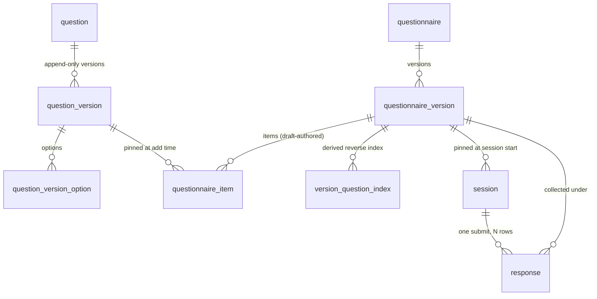

# Database Schema — Detailed Design

> The physical schema behind [[2-design-doc#12. Database]]: tables, constraints, indexes, the triggers and grants that carry the invariants, and the migration mechanics. The decisions this implements are already made — [[5-questionnaire-format#6. Versioning mechanics]] for versioning, [[7-application-boundary#3.2 Database grants]] for the boundary, [[6-observability#5. Audit trail]] for audit, [[3-scaling]] for partitioning. This doc is where they become DDL.
>
> Every statement below was loaded and exercised on PostgreSQL 16.13. Where a claim is a test result rather than an argument, it says so.

## 1. Shape

Three Postgres schemas.

| Schema | Holds | Written by |
| --- | --- | --- |
| `definition` | question bank, question versions, questionnaires, versions, draft items, `version_question_index` | `qp_definition` |
| `execution` | sessions, responses | `qp_execution` |
| `audit` | the audit log | nobody directly — see §8 |

[[7-application-boundary#3.2 Database grants]] already puts the definition/execution barrier in Postgres grants. Schemas are what make that rule structural instead of a list to maintain: `ALTER DEFAULT PRIVILEGES IN SCHEMA definition` means every authoring table added later is denied to `qp_execution` automatically. A per-table grant list has to be remembered, and `GRANT ... ON ALL TABLES IN SCHEMA` covers only the tables that exist when it runs — verified: a table added by a later migration is not covered, and the failure surfaces at runtime as `permission denied` rather than at migration time.



`audit.event` is deliberately absent from that diagram: it has no foreign keys (§8).

## 2. Conventions

- **`timestamptz` everywhere**, never `timestamp`. A naked `timestamp` in a system that records when a medical answer was given is a bug waiting for a deployment in another region.
- **snake_case columns**, via Drizzle's `casing: 'snake_case'`, so the TypeScript and the SQL can each read naturally.
- **UUIDv7 surrogate primary keys, generated in the application.** Postgres 16 has no `uuidv7()` and we are not adding an extension for it. Time-ordered ids give index locality on `response`, which is the only table with write volume.
- **`execution.session.id` is UUIDv4, not v7.** [[7-application-boundary#7. Access model and data barriers]] makes the session id a bearer capability; a capability should carry no ordering signal and no creation timestamp.
- **`item_id` and `option_id` stay authored `text` keys, not uuids.** They appear inside the evidentiary snapshot and inside stored responses, and both are read by humans when something goes wrong. `question_id` is a uuid because a question is a row in a bank rather than a key inside a document, and `question.key` is **not** carried into the snapshot alongside it ([[2-design-doc#17. Decisions Log]] #35).

### 2.1 Where the JSONB line falls

The rule, applied everywhere below: **anything a rule or a stored response can reference by id gets a row; everything else is a validated document.**

So `question_id`, `option_id` and `item_id` are columns with keys and foreign keys on them, while `minLength`, `min` / `max`, `numberKind`, `unit`, `multiline` and `relative` live together in one `constraints jsonb` column. Those are a per-type discriminated union with no cross-version identity — nothing points at them — and they are round-tripped whole by the same TypeBox schema `@qp/shared` needs anyway ([[5-questionnaire-format#2. Question types]]).

`visible_when` is JSONB for the same reason: a predicate is a value, not an entity. Nothing references a condition by id, and publish-time validation ([[5-questionnaire-format#5. Publish-time validation]]) is application code whichever way it is stored.

## 3. `definition`

```sql
CREATE TABLE definition.questionnaire (
  id                 uuid PRIMARY KEY,
  key                text UNIQUE,              -- slug for seeds and admin URLs
  name               text NOT NULL,            -- admin-facing label; mutable, never snapshotted
  closes_at          timestamptz,              -- §8.1 of the design doc: one nullable field
  current_version_id uuid,                     -- FK added after questionnaire_version exists
  current_version    int,
  created_at         timestamptz NOT NULL DEFAULT now(),
  CONSTRAINT current_version_pair CHECK ((current_version_id IS NULL) = (current_version IS NULL))
);
```

`name` is deliberately not `title`. The respondent-facing `title` is versioned and lives on the version row because it is inside the snapshot; the admin list needs a label that can be corrected without publishing. Two different things that would otherwise collide on one column.

`current_version_id` is [[3-scaling#4. Problem: hot definition reads]]'s "questionnaire → current published version" pointer — the only mutable value on the definition read path, and the single thing `POST /sessions` has to resolve. Maintained inside the publish transaction.

```sql
CREATE TABLE definition.questionnaire_version (
  id               uuid PRIMARY KEY,
  questionnaire_id uuid NOT NULL REFERENCES definition.questionnaire(id),
  version          int CHECK (version >= 1),   -- NULL while draft; assigned at publish
  status           text NOT NULL CHECK (status IN ('draft','published')),
  title            text NOT NULL,
  snapshot         jsonb,
  format_version   int,
  created_by       text,
  created_at       timestamptz NOT NULL DEFAULT now(),
  updated_at       timestamptz NOT NULL DEFAULT now(),  -- display only, never the ETag
  draft_revision   int NOT NULL DEFAULT 0,              -- the ETag's source of truth
  published_at     timestamptz,
  CONSTRAINT version_state CHECK (
    (status='draft'     AND version IS NULL     AND snapshot IS NULL     AND format_version IS NULL
                        AND published_at IS NULL)
 OR (status='published' AND version IS NOT NULL AND snapshot IS NOT NULL AND format_version IS NOT NULL
                        AND published_at IS NOT NULL)),
  CONSTRAINT qv_addressable UNIQUE (questionnaire_id, id, version)
);

CREATE UNIQUE INDEX questionnaire_one_draft
  ON definition.questionnaire_version (questionnaire_id) WHERE status = 'draft';
CREATE UNIQUE INDEX questionnaire_version_number
  ON definition.questionnaire_version (questionnaire_id, version);

-- circular reference: this cannot be inline on questionnaire, the target does not exist yet
ALTER TABLE definition.questionnaire
  ADD CONSTRAINT questionnaire_current_version_fk
  FOREIGN KEY (id, current_version_id, current_version)
  REFERENCES definition.questionnaire_version (questionnaire_id, id, version);
```

`version_state` makes draft and published genuinely different shapes rather than one shape with optional fields — a published row without a snapshot is not a state the table can hold.

`format_version` is lifted out of the JSONB into a column so that "which snapshot formats are still live" — the support window in [[2-design-doc#18. Open Questions]] §4, and the invariant gauge [[6-observability#9. Correctness and invariant monitoring]] wants — is an indexed query rather than a scan that deserializes every snapshot.

**On the circular foreign key.** `questionnaire` points at `questionnaire_version`, which points back
at `questionnaire`. A cycle between two tables is worth a second look, so: this is the ordinary
"parent holds a pointer to one designated child" shape — `company.primary_contact_id` alongside
`employee.company_id` — and it is benign here for a specific reason. A cycle is a genuine problem when
both sides are `NOT NULL`, because then neither row can be inserted first and every insert needs
deferred constraints; when both directions express *ownership*, which usually means the two tables
want to be one; or when it is long enough that no table is obviously the parent.

None of those hold. `current_version_id` is nullable, and a questionnaire with nothing published yet
genuinely points at nothing. Ownership runs one way — the back-pointer is a designation, not a claim.
The practical costs are bounded: the constraint is added by `ALTER TABLE` rather than inline (§11),
deleting a questionnaire outright would need the pointer cleared first, which the no-deletion rule in
[[2-design-doc#3. Constraints]] means we never do, and `pg_dump` restores fine because it recreates
foreign keys after loading data. There is even a small bonus: since §3.1's guard means the pointer can
never reference a draft, discarding a draft can never trip it.

**The redundancy is the part worth justifying, not the cycle.** "Current version" is derivable — it is
the highest published version number — so this column caches a computed answer, and the cycle is
simply what that cache looks like in a diagram. The justification: session start wants a direct
lookup rather than an aggregate, `(questionnaire_id, version)` is the key
[[3-scaling#4. Problem: hot definition reads]] caches on, and a stored pointer is what would later
allow pointing somewhere other than the newest version — a rollback, or a scheduled publish — which a
computed maximum could never express. Dropping the pointer and computing the maximum removes the
cycle and those three properties together; see §13.7.

**`draft_revision` is what the draft ETag is built from, and `updated_at` is not.** Every draft mutation
increments the counter in the same transaction as the change it describes; `PUT /draft` compares the
`If-Match` value against it ([[7-application-boundary#4.1 Endpoints]]). Both columns exist and only one is
load-bearing: `updated_at` answers "last edited three minutes ago" in the admin list, while the counter
answers "is the draft you are holding still current". A timestamp cannot do the second job — two writes
inside one millisecond compare equal, and a concurrency check must not depend on a clock, for the same
reason list ordering does not (Decisions Log #40) and the submit digest does not (#37). Both freeze at
publish, since a published row is immutable.

### 3.1 The published-only guard

`qv_addressable` looks redundant next to the primary key. It is the mechanism that turns two
would-be application checks into foreign keys. It is worth spelling out plainly, because the trick is
not obvious and it is the single cheapest correctness win in this schema.

**The problem.** The `questionnaire` row records which version a new respondent should be served —
that is what `current_version_id` is for, so session start is one direct lookup rather than a search.
The obvious rule to put on it is "this must be some row in `questionnaire_version`". That rule is too
weak. Consider:

| id | questionnaire_id | version | status |
| --- | --- | --- | --- |
| `aaa` | intake | 1 | published |
| `bbb` | intake | 2 | published |
| `ccc` | intake | *(none)* | draft |
| `ddd` | onboarding | 1 | published |

Under the weak rule, intake may point at `ccc` — its own unfinished draft — or at `ddd`, which belongs
to a different questionnaire entirely. Both are real rows, so the rule is satisfied, and both are
badly wrong: a respondent served an unpublished draft, or served the wrong questionnaire. What we
actually want guaranteed is *a published version, of this questionnaire*.

**The trick.** Look at `ccc`: a draft has no version number. `version` is assigned at publish, so
**"has a version number" and "is published" are the same fact**. There is no need to check `status` at
all — the presence of a number already says it.

So rather than checking one value, check the combination of three: the questionnaire, the version row,
and the version number. `qv_addressable` makes that triple unique, and the foreign key requires it to
exist. Intake's row holds `(intake, bbb, 2)`, which is row `bbb`. Allowed. The two bad cases both
fail, and it is worth seeing why:

- **Pointing at the draft `ccc`** — there is no number to write. `ccc` has none, so any number invented
  for it, say 3, forms the triple `(intake, ccc, 3)`, which exists nowhere. Rejected.
- **Pointing at `ddd`** — that is `(intake, ddd, 1)`, but `ddd` belongs to onboarding. That triple does
  not exist either. Rejected.

Both verified against a live database. The same foreign key on `execution.session` means a session
cannot pin a draft, by the same argument.

**This is why `current_version_id` is paired with `current_version`.** The rule is about the triple,
and a foreign key must supply a value for every column it matches against. The questionnaire already
has its own `id` — that is one part — so it stores the other two. `current_version` is not duplicated
information; it is the third piece of the key. `current_version_pair` then says both are filled or
both are empty, and Postgres's `MATCH SIMPLE` semantics skip the check entirely while they are NULL,
which is correct for a questionnaire with nothing published yet.

The cost is one redundant-looking column and a reviewer's raised eyebrow. What it buys is that
"serve a draft to a respondent" and "serve another questionnaire's version" stop being bugs that code
review has to catch, and become writes the database refuses. Neither can be refactored away by
accident, because neither lives in code at all.

**A smaller variant exists.** Checking `(questionnaire_id, version)` instead of the full triple gives
the same two guarantees using `questionnaire_version_number`, which already exists — dropping
`current_version_id` and the paired CHECK, at the cost of naming the current version by a different
key than every other version reference in the schema. Tested and viable; see §13.7.

### 3.2 The question bank

```sql
CREATE TABLE definition.question (
  id          uuid PRIMARY KEY,
  key         text UNIQUE,
  archived_at timestamptz,                   -- archived, never deleted (Decisions Log #15)
  created_at  timestamptz NOT NULL DEFAULT now()
);

CREATE TABLE definition.question_version (   -- append-only (Decisions Log #13)
  question_id uuid NOT NULL REFERENCES definition.question(id),
  version     int  NOT NULL CHECK (version >= 1),
  type        text NOT NULL CHECK (type IN
                ('text','single_choice','multiple_choice','number','date')),
  prompt      text NOT NULL,
  constraints jsonb NOT NULL DEFAULT '{}'::jsonb,
  created_by  text,
  created_at  timestamptz NOT NULL DEFAULT now(),
  PRIMARY KEY (question_id, version)
);

CREATE TABLE definition.question_version_option (
  question_id uuid NOT NULL,
  version     int  NOT NULL,
  option_id   text NOT NULL,
  label       text NOT NULL,
  position    int  NOT NULL,
  freeform    boolean NOT NULL DEFAULT false,
  PRIMARY KEY (question_id, version, option_id),
  FOREIGN KEY (question_id, version) REFERENCES definition.question_version(question_id, version),
  UNIQUE (question_id, version, position),
  CONSTRAINT freeform_exactly_when_other CHECK (freeform = (option_id = 'other'))
);
```

There is no `yes_no` type. A yes/no question is a `single_choice` with two options, created by an editor
template that seeds the reserved ids `yes` / `no` with editable labels — one storage shape and one operator
set, per Decisions Log #36 (superseding #10). Nothing in the schema enforces `yes` / `no`; see the note
on option-id stability below, which is the same tier of guarantee. The id `other` is enforced, by the check below.

`freeform_exactly_when_other` closes a gap between the boolean and the format doc. [[5-questionnaire-format#2.3 The `other` option]] reserves the id `other` for the freeform option, and rules test it by name. A bare `freeform boolean` would allow `opt_misc` to be marked freeform, an option that can never carry `otherText` because the response-side constraint keys on the literal `other`. It would also allow a plain option under `other`, which the response-side constraint would let carry `otherText`. The check makes an option freeform exactly when its id is `other`, both ways (Decisions Log #83). Because every freeform row then has the id `other`, the primary key allows at most one per version. That is now the only thing holding that invariant: if `freeform_exactly_when_other` is ever relaxed, for example to allow a second freeform id, restore `qvo_one_freeform`, because the primary key alone does not limit freeform options. Migration `0015` dropped the partial unique index `qvo_one_freeform` that enforced this before. On a database that already holds a row breaking the check, `0015` stops before changing anything and names the row, because no migration may rewrite a question version; the backend README's "Migrations that refuse existing data" gives the recovery.

**On option-id stability.** [[5-questionnaire-format#2.1 Option ids are stable across question versions]] guarantees option ids survive a version bump. An earlier draft of this schema added a `question_option (question_id, option_id)` registry so that guarantee would be a foreign key. It was dropped, because it does not deliver it: the application inserts into the registry on demand, so nothing distinguishes "renamed an option's label" from "minted a new id". A table that looks like an enforcement mechanism without being one is worse than no table. Stability is preserved by the editor copying ids forward into version N+1, and proven by the v2 demo test — which is exactly the role [[8-testing#3. Required coverage — the graded list]] already assigns it.

### 3.3 Items and the reverse index

```sql
CREATE TABLE definition.questionnaire_item (
  questionnaire_version_id uuid NOT NULL REFERENCES definition.questionnaire_version(id),
  item_id                  text NOT NULL,
  position                 int  NOT NULL,
  required                 boolean NOT NULL DEFAULT false,
  visible_when             jsonb,                 -- NULL = always visible
  question_id              uuid NOT NULL,
  question_version         int  NOT NULL,         -- pinned at add time
  PRIMARY KEY (questionnaire_version_id, item_id),
  FOREIGN KEY (question_id, question_version)
    REFERENCES definition.question_version(question_id, version),
  CONSTRAINT item_position_unique UNIQUE (questionnaire_version_id, position)
    DEFERRABLE INITIALLY IMMEDIATE
);

CREATE TABLE definition.version_question_index (   -- derived; rebuildable from snapshots
  questionnaire_version_id uuid NOT NULL REFERENCES definition.questionnaire_version(id),
  question_id              uuid NOT NULL,
  question_version         int  NOT NULL,
  PRIMARY KEY (questionnaire_version_id, question_id, question_version),
  FOREIGN KEY (question_id, question_version)
    REFERENCES definition.question_version(question_id, version)
);
CREATE INDEX vqi_reverse ON definition.version_question_index (question_id, question_version);
```

The foreign key on `(question_id, question_version)` is the pin from [[5-questionnaire-format#6.2 Question identity and versioning]] made physical: an item cannot reference a question version that does not exist, and because question versions are never deleted it can never dangle.

**`item_position_unique` has to be `DEFERRABLE`.** Dragging item 3 above item 1 is a set of position updates that is unique only once the statement finishes. A non-deferrable constraint forces either a negative-position shuffle or a carefully ordered sequence of updates in the repository — both of which are workarounds for a constraint that is simply being checked too early. Declared `INITIALLY IMMEDIATE` so ordinary writes behave normally, with `SET CONSTRAINTS ... DEFERRED` inside the reorder transaction only.

**Item rows are kept after publish**, not deleted. That keeps "the next draft is an explicit copy of the latest published version" ([[5-questionnaire-format#6.1 Questionnaire versions]]) an `INSERT ... SELECT` with no snapshot-deserialize path to get wrong, and it stays inside [[2-design-doc#3. Constraints]]. The snapshot stays authoritative; the item rows are a normalized mirror, useful for admin diffing and for the invariant check that re-serializes them and compares.

## 4. Immutability in the data layer

[[5-questionnaire-format#6.4 Three layers of immutability enforcement]] names the database as layer one. This is that layer.

```sql
CREATE FUNCTION definition.reject_mutation() RETURNS trigger LANGUAGE plpgsql AS $$
BEGIN
  RAISE EXCEPTION 'row is published and immutable' USING ERRCODE = 'QP001';
END $$;

CREATE TRIGGER qv_immutable_update BEFORE UPDATE ON definition.questionnaire_version
  FOR EACH ROW WHEN (OLD.status = 'published') EXECUTE FUNCTION definition.reject_mutation();
CREATE TRIGGER qv_immutable_delete BEFORE DELETE ON definition.questionnaire_version
  FOR EACH ROW WHEN (OLD.status = 'published') EXECUTE FUNCTION definition.reject_mutation();
CREATE TRIGGER qv_immutable_insert BEFORE INSERT ON definition.questionnaire_version
  FOR EACH ROW WHEN (NEW.status = 'published') EXECUTE FUNCTION definition.reject_mutation();
```

The promoting `UPDATE` at publish is allowed, because the trigger is evaluated against `OLD.status = 'draft'`. That is also why the triggers alone do not make publish the only way to a published row — §4.3 is the part that does.

**The `INSERT` trigger closes the shortcut §11.6 rules out.** Without it, a row inserted already `published` with a complete snapshot satisfies `version_state`; only its items are refused, by §4.1's guard. Reproduced against a live database as `qp_definition`. With it, a published row exists only by promoting a draft in place (Decisions Log #8, #46).

**The `DELETE` trigger is an addition to what §6.4 specifies.** That section describes a trigger on `UPDATE` only. Deleting a published version destroys the definition that historical responses are rendered against — the same failure the `UPDATE` trigger exists to prevent, reached by a different verb, and now also a violation of the general rule in [[2-design-doc#3. Constraints]].

Question versions take the blunt form: a trigger rejecting every `UPDATE` and `DELETE` on `question_version` and `question_version_option`, unconditionally. That is what append-only means when it is a database guarantee rather than a repository convention.

### 4.1 The item guard, and the two ways it fails naively

Item rows need their own guard keyed on the parent's status, or a published version's items remain editable behind the version row's back.

```sql
CREATE FUNCTION definition.reject_item_mutation() RETURNS trigger LANGUAGE plpgsql AS $$
DECLARE parent_status text;
BEGIN
  IF TG_OP = 'UPDATE' AND NEW.questionnaire_version_id <> OLD.questionnaire_version_id THEN
    RAISE EXCEPTION 'items cannot be reparented' USING ERRCODE = 'QP001';
  END IF;
  SELECT status INTO parent_status FROM definition.questionnaire_version
   WHERE id = COALESCE(NEW.questionnaire_version_id, OLD.questionnaire_version_id)
   FOR SHARE;
  IF parent_status = 'published' THEN
    RAISE EXCEPTION 'questionnaire version is published and immutable' USING ERRCODE = 'QP001';
  END IF;
  RETURN COALESCE(NEW, OLD);
END $$;

CREATE TRIGGER item_immutable BEFORE INSERT OR UPDATE OR DELETE ON definition.questionnaire_item
  FOR EACH ROW EXECUTE FUNCTION definition.reject_item_mutation();
```

Both defensive lines exist because the obvious version of this trigger fails, and both failures were reproduced against a live database before the fix:

- **`FOR SHARE`, not a bare `SELECT`.** Without the lock the trigger is a time-of-check/time-of-use race. A publish transaction reads the items, writes the snapshot and flips status; a second connection inserts another item half a second later, sees `draft` because the publish is still uncommitted, and commits. Result: a published version whose snapshot lists one item and whose item rows number two, with no error raised anywhere. That is precisely the drift keeping item rows is supposed not to cause. `FOR SHARE` makes the trigger block behind the in-flight publish and re-read after it commits, at which point the insert is correctly rejected.
- **The reparent check.** Without it, `UPDATE questionnaire_item SET questionnaire_version_id = <draft> WHERE questionnaire_version_id = <published>` succeeds: the trigger only ever inspects one of the two parents, so an item walks out of a published version.

**Ordering requirement on publish.** `version_question_index` must be written and any item work finished *before* status flips, or the publishing transaction trips this guard. `definition.promote_draft` (§4.3) does both in that order, so no repository code has to remember it.

Deleting an item is part of editing a draft, so `qp_definition` holds `DELETE` on `questionnaire_item` and on no other table (§10, Decisions Log #45). This guard is what bounds it: a `DELETE` whose parent is published is `QP001`.

### 4.2 `QP001`

A custom SQLSTATE, verified to reach the client intact through `pg`. It is mapped to `409` in one place in the Fastify error handler, so layer one and layer two of the immutability story ([[7-application-boundary#6.2 Status codes]]) cannot disagree about what happened — the API returns a `409` because the database said `QP001`, not because a service-layer check happened to run first.

### 4.3 Publishing goes through `definition.promote_draft`

The triggers stop a published row from changing. They did not stop a draft from being promoted by something
other than publish: `qp_definition` could flip a draft to `published` with one `UPDATE` carrying any
snapshot, and move the current-version pointer to it with a second, leaving no validation and no
`version_question_index` rows. Reproduced against a live database.

So promotion is a `SECURITY DEFINER` function, the same shape §9.1 uses for audit:

- `qp_definition` holds column-level `UPDATE` only on the columns editing a draft needs (§10). Status,
  version, snapshot, `format_version`, `published_at` and the pointer pair are not writable by it.
- `definition.promote_draft(version_id, snapshot)` is owned by `qp_owner`, runs with
  `SET search_path = definition, pg_temp`, and is executable by `qp_definition` alone. It locks the
  version row and requires a draft (`QP001` otherwise); requires the snapshot to name this questionnaire,
  its next version number and exactly the draft's item rows — item ids, pinned question versions, in
  position order (`22023` otherwise); writes `version_question_index` from the item rows; promotes with
  `WHERE status = 'draft'`; and moves the pointer.
- **The audit row is not the function's.** `publishDraft` writes it straight after, through the one
  repository function that calls `audit.record` (§9.1), as `qp_definition` and in the same transaction, so
  a failed audit write rolls the promotion back and a publish cannot commit without its record
  ([[6-observability#5.1 Isolation — separate schema with a restricted role]]).

**Validation stays in the application.** Publish-time validation ([[5-questionnaire-format#5. Publish-time validation]])
is `validateDraft` in `@qp/shared` — the same function `POST /draft/validate` calls — and cannot move into
SQL without becoming a second implementation. `publishDraft` takes the §5 locks, serializes the draft, runs
it, and only then calls the function. The snapshot check is what makes that split safe: the function cannot
judge a predicate, but it refuses a snapshot whose structure is not the draft it is promoting, so skipping
validation cannot publish an item list the item rows do not already hold.

The residual, stated: code holding `qp_definition` can still publish a draft that skipped validation, or
whose prompts and predicates were serialized wrongly — and, because the function does not audit, it can call
`promote_draft` directly and publish **without an audit row**. That last one was accepted deliberately
(Decisions Log #51). Auditing from inside the function would have meant granting its owner, `qp_owner`, a path
into `audit`, reversing §9.1's arrangement that the migration identity has none; making `audit_owner` own the
function instead would turn the audit role into a definition-writing role, and the `audit` schema is kept
audit-only so it stays extractable behind the outbox. What the function guarantees is narrower and structural
— no published row without its index rows and pointer, and no snapshot that disagrees with the item rows it
was built from. Audit completeness for publish rests on `publishDraft` being the only caller, as it does for
every other authoring action.

## 5. Concurrency control

[[2-design-doc#11. Backend]] owes an answer here and the brief lists it as a design-defense topic. Three races exist; all three were reproduced with two concurrent connections before being fixed, and all three are fixed by taking the right row lock first rather than by retry logic.

| Race | What happens without the lock | Fix |
| --- | --- | --- |
| Two publishes of the same draft | Safe already. `promote_draft` re-reads the version row under its own lock and refuses anything but a draft, and its promoting `UPDATE ... WHERE status = 'draft'` is a compare-and-swap behind the partial unique index | — |
| Publish vs. create-next-draft | B reads "latest published = v1" while A's publish to v2 is uncommitted, then creates a draft copied from v1. Both commit. Publishing that draft as v3 silently reverts v2, and neither transaction errors | `SELECT ... FROM definition.questionnaire WHERE id = $1 FOR UPDATE` as the **first** statement of publish, create-draft and retire |
| Two edits to the same question | Both compute `version = max + 1 = 3`; the loser gets a raw `23505` from the primary key | `SELECT ... FROM definition.question WHERE id = $1 FOR UPDATE` before computing the next version. Map `23505` on that path to `409` regardless |

The middle row is the dangerous one: it is the only failure here that corrupts state rather than raising an error, and it produces a questionnaire whose published history silently loses a version.

Publish also takes `FOR UPDATE` on the version row before reading items, which is what makes §4.1's `FOR SHARE` in the item trigger block rather than read stale status. The full publish order is: the questionnaire row, then the draft version row, then read, serialize and validate in the application, then `promote_draft` (§4.3), whose own `FOR UPDATE` on the version row is already held and so adds no wait, then the audit row.

## 6. `execution`

```sql
CREATE TABLE execution.session (
  id                       uuid PRIMARY KEY,          -- v4: bearer capability
  questionnaire_id         uuid NOT NULL,
  questionnaire_version_id uuid NOT NULL,
  version                  int  NOT NULL,
  status                   text NOT NULL CHECK (status IN ('in_progress','submitted')),
  started_at               timestamptz NOT NULL DEFAULT now(),
  last_activity_at         timestamptz NOT NULL DEFAULT now(),
  submitted_at             timestamptz,
  response_digest          bytea,
  FOREIGN KEY (questionnaire_id, questionnaire_version_id, version)
    REFERENCES definition.questionnaire_version (questionnaire_id, id, version),
  CONSTRAINT session_state CHECK (
    (status='in_progress' AND submitted_at IS NULL     AND response_digest IS NULL)
 OR (status='submitted'   AND submitted_at IS NOT NULL AND response_digest IS NOT NULL))
);
CREATE INDEX session_by_version  ON execution.session (questionnaire_version_id, started_at);
CREATE INDEX session_in_progress ON execution.session (questionnaire_id, last_activity_at)
  WHERE status = 'in_progress';
```

`status` and `session_state` together make `in_progress → submitted` the only lifecycle the table can express, matching [[7-application-boundary#5.3 Session lifecycle]]. Abandonment is the absence of a submit, so it has no column.

`response_digest` is the idempotency mechanism from Decisions Log #19 — SHA-256 over the canonicalized answers, written at first submit. There is no separate idempotency-key table because the session *is* the key.

The canonical form is specified in [[7-application-boundary#5.4 Submit: authority, validation, idempotency]] and is a **pure function of the `response` rows for that session** — every field it reads (`item_id`, `question_type`, the value columns, `option_ids`, `other_text`) is stored. That is deliberate and is the property to preserve: it makes a later change to the canonicalization a backfill (`UPDATE session SET response_digest` recomputed from the rows) rather than an irreversible choice. Do not fold anything unpersisted into the digest.

The composite foreign key is §3.1's published-only guard.

**Sessions are not partitioned.** They are point-looked-up by primary key on the resume path, and a partitioned table queried without its partition key scans every partition. Archiving old sessions is a move job, not a `DETACH`.

### 6.1 `response`

```sql
CREATE TABLE execution.response (
  id                       uuid NOT NULL,
  created_at               timestamptz NOT NULL,      -- no default; see §6.3
  session_id               uuid NOT NULL REFERENCES execution.session(id),
  questionnaire_version_id uuid NOT NULL REFERENCES definition.questionnaire_version(id),
  item_id                  text NOT NULL,
  question_id              uuid NOT NULL,             -- what you aggregate on
  question_version         int  NOT NULL,             -- what you render with
  question_type            text NOT NULL,
  text_value   text,
  number_value numeric,
  number_unit  text,
  date_value   date,
  option_ids   text[],
  other_text   text,
  PRIMARY KEY (id, created_at),
  CONSTRAINT response_shape CHECK (COALESCE(
    CASE question_type
      WHEN 'text' THEN text_value IS NOT NULL AND text_value <> ''
        AND option_ids IS NULL AND number_value IS NULL AND date_value IS NULL AND other_text IS NULL
      WHEN 'number' THEN number_value IS NOT NULL
        AND text_value IS NULL AND option_ids IS NULL AND date_value IS NULL AND other_text IS NULL
      WHEN 'date' THEN date_value IS NOT NULL
        AND text_value IS NULL AND option_ids IS NULL AND number_value IS NULL AND other_text IS NULL
      WHEN 'single_choice' THEN option_ids IS NOT NULL AND cardinality(option_ids) = 1
        AND array_position(option_ids, NULL) IS NULL
        AND text_value IS NULL AND number_value IS NULL AND date_value IS NULL
      WHEN 'multiple_choice' THEN option_ids IS NOT NULL AND cardinality(option_ids) >= 1
        AND array_position(option_ids, NULL) IS NULL
        AND text_value IS NULL AND number_value IS NULL AND date_value IS NULL
      ELSE false END, false)),
  CONSTRAINT other_text_needs_other CHECK (
    other_text IS NULL OR (option_ids IS NOT NULL AND 'other' = ANY(option_ids))),
  CONSTRAINT number_unit_needs_value CHECK (number_unit IS NULL OR number_value IS NOT NULL)
) PARTITION BY RANGE (created_at);
```

The columns are [[5-questionnaire-format#6.3 What a response stores]] directly: `question_id` to aggregate on, `question_version` to render with, `questionnaire_version_id` as the route to the snapshot, and the value in a form that does not depend on labels.

**Typed columns rather than one `value jsonb`.** Three reasons, in order of weight:

1. `option_ids` with a GIN index makes "how many respondents chose `opt_diabetes`" an index scan. That is the commonest analytics query this domain has, and a JSONB blob answers it with a sequential scan and a cast.
2. `numeric` plus `number_unit` expresses Decisions Log #12 as two columns rather than as a convention about the shape of a document. `numeric` and not `double precision`: an evidentiary record should not round. `numeric` also preserves the scale of its input (`'72.50'` reads back as `72.50`), so the submit validator writes the canonical decimal (`72.5`; `-0` as `0`) and the stored value agrees with the answer digest ([[7-application-boundary#5.4 Submit: authority, validation, idempotency]]).
3. The `CASE` makes an invalid answer shape unrepresentable — the same move the branching design makes in the type system ([[5-questionnaire-format#4.2 Conditions are typed per response type]]), applied one layer down.

`date_value` is `date` rather than `timestamptz` because a date question collects a calendar date; giving it a timezone would invent precision the respondent never supplied.

The cost of typed columns, stated: a seventh response type is a migration rather than a code change. That is the right trade at five types that are enumerated in the brief and unlikely to grow during the prototype.

### 6.2 `COALESCE(..., false)` is load-bearing

A `CHECK` constraint passes when its expression evaluates to NULL, and NULL propagates through comparisons. `cardinality(NULL) = 1` is NULL, not false.

Without the `COALESCE` wrapper and the explicit `IS NOT NULL` guards, every one of these inserts cleanly — verified:

| Attempted row | Why it slipped through |
| --- | --- |
| `single_choice` with `option_ids = NULL` | `cardinality(NULL) = 1` → NULL → check passes |
| `multiple_choice` with `option_ids = NULL` | same |
| `single_choice` with `ARRAY[NULL]` | cardinality is 1; the element is never inspected |
| `text` with `''` | `'' IS NOT NULL` is true |

A choice answer with no choice in it is the exact shape the constraint exists to forbid. With the wrapper, `array_position(option_ids, NULL) IS NULL` and `text_value <> ''`, all four are rejected and valid rows still insert — both directions tested.

Duplicate ids *within* `option_ids` are the one shape this constraint does not close. A `CHECK` may not
contain a subquery, and de-duplicating an array needs one (`SELECT count(DISTINCT e) FROM unnest(a) e`) —
Postgres has no core array-distinct operator — so the only inline form is an `IMMUTABLE` helper function
wrapping that subquery.

**Decided: the application validates this, the database does not** ([[2-design-doc#17. Decisions Log]] #34,
under the simplicity principle #33). The submit validator already walks `option_ids` to check every id
against the pinned question version's options, so uniqueness is one line beside a walk that has to happen
regardless, and it returns a `422` naming the item rather than a constraint violation. The rejected helper
is written up in §13.8 and carried as [[2-design-doc#19. Future Work]]; adding it later is one custom
migration and no application change.

Two things worth stating rather than leaving implied. The scope is narrower than it looks: `single_choice` is
`cardinality(...) = 1`, so a duplicate is unrepresentable there and only the `multiple_choice` branch is
affected. And the harm is specific rather than general — a containment query
(`'opt_x' = ANY(option_ids)`) still counts the row once, but `GROUP BY unnest(option_ids)`, which is the
shape of the "how many chose each option" query §6.1 justifies this column with, counts the duplicate
twice.

### 6.3 Which foreign keys, and why not more

`session_id`, `questionnaire_version_id`, and the pair of them checked against the session's pin — nothing else.

**The pair is checked against the session.** The two single-column keys hold independently, so a response on a session pinned to v1 could carry another questionnaire's version, or a draft's, and insert cleanly — reproduced as `qp_execution`. `response (session_id, questionnaire_version_id)` therefore references `session (id, questionnaire_version_id)`, made referenceable by `session_pinned_version_key`, so a response cannot claim a version its session did not pin ([[2-design-doc#17. Decisions Log]] #49). The key stays inside `execution`, so it reaches into no authoring table. The two single-column keys stay: they are now implied, and keeping them is cheaper than re-arguing this section.

An FK on `(questionnaire_version_id, item_id)` into `questionnaire_item` would validate more, and a partitioned table referencing a regular table is allowed (verified). It is omitted on purpose: `questionnaire_item` is an authoring table, and [[7-application-boundary#2.1 What execution is structurally denied]] says execution never reaches into one. `questionnaire_version` is the artifact that *crosses* the boundary, so a foreign key to it is consistent with the model; item and question-version validity are the submit-time rule engine's job against the snapshot, which is already the authority ([[7-application-boundary#5.4 Submit: authority, validation, idempotency]]).

This is a case where the stricter database and the stated architecture disagree, and the architecture wins — otherwise the first thing a service split would have to do is drop a constraint we had just finished defending.

### 6.4 Partitioning

Monthly `RANGE (created_at)`, **no `DEFAULT` partition**, with 24–36 partitions pre-created by the migration.

```sql
CREATE TABLE execution.response_2026_09 PARTITION OF execution.response
  FOR VALUES FROM ('2026-09-01') TO ('2026-10-01');
-- ... one per month
```

**The absence of a default partition is deliberate, not an oversight.** A default partition looks like cheap insurance against a missed rollover. It costs both of the operations partitioning exists for, and both were verified:

- `ALTER TABLE ... DETACH PARTITION ... CONCURRENTLY` is refused outright while a default partition exists (`55000 cannot detach partitions concurrently when a default partition exists`). That turns [[3-scaling#3. Problem: response ingest vs. reads]]'s archival lever into an operation that takes `ACCESS EXCLUSIVE` on the hot table.
- Attaching a new partition while the default holds rows matching its range is not a slow scan, it is a hard error (`23514 updated partition constraint for default partition ... would be violated by some row`). The rows have to be moved out first, under load, which is the worst possible time.

Pre-created partitions plus a documented rollover task is the honest prototype answer; `pg_partman` or a scheduled job is the production one. A missed rollover then fails the insert loudly, which is recoverable, rather than quietly filling a default partition that later blocks the fix.

**`created_at` is set explicitly, never defaulted.** Submit computes `session.submitted_at = now()` and inserts every response row with `created_at` set to that same value. Two things follow:

- Every response for a session is provably in one partition, because they share one literal value rather than relying on `now()` happening to be transaction-scoped.
- The idempotent replay path reads `WHERE session_id = $1 AND created_at = $submitted_at`, which prunes to a single partition — verified: `Index Scan using response_2026_09_session_id_created_at_idx`, one partition touched.

There is deliberately **no unique index on `(session_id, item_id)`**. It could not be global on a partitioned table anyway — a unique index must contain the partition key — and a `(session_id, item_id, created_at)` index that only holds within a partition would look like a guarantee while being one. The actual guarantee is the `FOR UPDATE` on the session row plus the `in_progress → submitted` transition, which makes a second write impossible. One guarantee that holds beats two where one is decorative.

## 7. Indexing strategy

Every index below exists for a named query or a named invariant. Nothing is indexed speculatively.

| Index | Serves |
| --- | --- |
| `questionnaire_one_draft` | the one-draft invariant; not an access path |
| `questionnaire_version_number` | version lookup by number, and uniqueness of it |
| `qv_addressable` | §3.1's published-only foreign keys |
| `vqi_reverse` | "which published versions contain question X" ([[2-design-doc#12. Database]] §12.1) |
| `session` PK | resume — `GET /sessions/:sessionId`, a point lookup |
| `session_by_version` | "sessions started against version N", for the republish story and analytics |
| `session_in_progress` (partial) | abandonment analytics; partial because submitted sessions are the majority and are never the subject of this query |
| `session_pinned_version_key (id, questionnaire_version_id)` | the target of `response`'s composite foreign key (§6.3); an invariant, not an access path |
| `response_by_session (session_id, created_at)` | idempotent replay, with partition pruning (§6.4) |
| `response_by_question` | per-version analytics over one question |
| `response_by_option` (GIN) | "how many respondents chose option X" |

Deliberately **not** indexed:

- **No GIN index on `snapshot`.** Access is whole-document by construction ([[2-design-doc#12. Database]] §12.1), and `version_question_index` exists precisely so the one query that would want a GIN index does not need one.
- **No index on `closes_at`.** It is compared on a row already fetched by primary key, never used to filter a scan, and the questionnaire count is in the dozens.
- **No index on `question.archived_at`.** Same reason: the bank is small and the picker reads all of it.

## 8. Read/write characteristics

The two halves of this schema have almost opposite profiles, which is why they get different treatment throughout.

**Definition tables — small, hot reads, rare careful writes.** Row counts are in the dozens to hundreds. Writes happen at human speed and are almost all multi-statement transactions with row locks (§5); a lost or partial publish is a correctness failure, not a throughput problem, so these paths are optimised for reliability and are allowed to be slow. Reads look hot but mostly are not: `POST /sessions` does one indexed read of `questionnaire` for `closes_at` and `current_version_id`, then one primary-key read of `questionnaire_version` for the snapshot, after which the compiled definition is held in an in-process cache that never needs invalidating ([[3-scaling#4. Problem: hot definition reads]]). Steady-state definition reads approach zero database work per session.

**`execution.response` — large, append-only, bulk writes, lagging reads.** One burst of N rows per completed session, never updated, never deleted. Throughput matters and per-row latency does not, because the write is already inside a transaction the respondent is waiting on once. Reads are analytics: cross-session, tolerant of replication lag, and the first candidate for a read replica ([[3-scaling#3. Problem: response ingest vs. reads]]).

**`execution.session` — the only contended row, and contended only with itself.** Read-modify-write per session, point lookups by primary key, plus a `FOR UPDATE` at submit. Two respondents never touch the same row, so lock contention is structurally bounded at one.

That split is what justifies partitioning exactly one table, putting the GIN index on exactly one column, and spending the concurrency budget entirely on the definition side.

## 9. `audit`

```sql
CREATE TABLE audit.event (
  id                       uuid PRIMARY KEY DEFAULT gen_random_uuid(),  -- its own id
  occurred_at              timestamptz NOT NULL DEFAULT now(),          -- its own timestamp
  actor_type               text NOT NULL DEFAULT 'system',
  actor_id                 text,
  action                   text NOT NULL CHECK (action IN
                             ('create_draft','edit_draft','publish','retire','reopen',
                              'archive_question','create_question_version')),
  questionnaire_id         uuid,
  questionnaire_version_id uuid,
  version                  int,
  summary                  jsonb,
  trace_id                 text
);
CREATE INDEX audit_by_questionnaire ON audit.event (questionnaire_id, occurred_at DESC);
```

**No foreign keys, deliberately.** The deferred move in [[6-observability#5.1 Isolation — separate schema with a restricted role]] is to lift this table into its own database behind a transactional outbox, and foreign keys into `definition` would have to be dropped to do it. The same section's requirement that audit rows carry their own id and timestamp rather than borrowing the domain row's is the other half of the same argument.

`trace_id` correlates an audit row to the OpenTelemetry trace that produced it without putting anything about a respondent's answers into either — audit covers authoring actions only.

The action list is wider than [[6-observability#5. Audit trail]] enumerates. `create_draft` and `reopen` (clearing `closes_at`) are real state changes an auditor would ask about, and `create_question_version` covers the fact that a new question version changes what patients are asked — `question_version.created_by` records who, and the audit row records when and in what context.

### 9.1 A dedicated role, inside the publish transaction

[[6-observability#5.1 Isolation — separate schema with a restricted role]] asks for two things that look incompatible: the audit write goes through a dedicated role, *and* it joins the transaction performing the domain change. A second connection would satisfy the first and break the second.

They are compatible. A `SECURITY DEFINER` function owned by the audit role gives both, and gives a stronger guarantee than narrowing grants on the application role would:

```sql
GRANT CREATE ON SCHEMA audit TO audit_owner;   -- while qp_owner still owns the schema
ALTER TABLE  audit.event   OWNER TO audit_owner;
ALTER SCHEMA audit         OWNER TO audit_owner;

SET LOCAL ROLE audit_owner;  -- qp_owner loses USAGE on `audit` the instant the line above commits

CREATE FUNCTION audit.record(p_action text, p_qid uuid, p_qvid uuid, p_version int,
                             p_actor_id text, p_summary jsonb, p_trace_id text)
RETURNS uuid LANGUAGE sql SECURITY DEFINER SET search_path = audit, pg_temp AS $$
  INSERT INTO audit.event (action, questionnaire_id, questionnaire_version_id,
                           version, actor_id, summary, trace_id)
  VALUES (p_action, p_qid, p_qvid, p_version, p_actor_id, p_summary, p_trace_id)
  RETURNING id;
$$;

REVOKE ALL ON audit.event  FROM PUBLIC;
REVOKE ALL ON SCHEMA audit FROM PUBLIC;
REVOKE EXECUTE ON FUNCTION audit.record(text,uuid,uuid,int,text,jsonb,text) FROM PUBLIC;
GRANT  USAGE   ON SCHEMA audit TO qp_definition;
GRANT  EXECUTE ON FUNCTION audit.record(text,uuid,uuid,int,text,jsonb,text) TO qp_definition;
```

**`EXECUTE` on a new function is granted to `PUBLIC` by default**, so without the third `REVOKE` every role
could call `audit.record` — held back only by lacking `USAGE` on the schema, and a privilege check would
report that it can. The revoke landed in a later migration (`0014`) with the same sweep for every function in
the three schemas, so `qp_definition`'s explicit grant is the only one.

Verified end to end:

- `qp_definition` calls `audit.record(...)` in the same transaction as a `definition` write, and both commit together.
- `qp_definition` holds **zero** direct privileges on `audit.event` — direct `INSERT`, `UPDATE` and even `SELECT` all fail with `permission denied for table event`.
- `ROLLBACK` discards the audit row along with the domain change, so a publish that fails leaves no record claiming it happened.

Append-only stops being "a role that was only granted `INSERT`" and becomes "a table no application role can reach at all, behind one function that only appends". The single repository function §5.1 already requires is the same object that enforces it, which is why this costs nothing extra.

`SET LOCAL ROLE` with `GRANT ... WITH INHERIT FALSE` also works and was tested; it is the alternative in §13.3.

**`SET search_path = audit, pg_temp` is load-bearing, not decoration.** A `SECURITY DEFINER` function
without a pinned search path is the classic Postgres privilege-escalation vector: a caller creates a
same-named object in a schema that sorts earlier on the path and the definer executes it with the
owner's rights. Pinned path, `pg_temp` last, schema-qualified body — all three matter, and none of them
should be "simplified" later.

**One trap, hit while building this.** The function owner needs `USAGE` on the schema. If `audit_owner` owns the function but the schema is still owned by the migration role and `PUBLIC` has been revoked, every call fails at runtime with `permission denied for schema audit` — after the migration has apparently succeeded. `ALTER SCHEMA audit OWNER TO audit_owner` is the line that prevents it.

**A second trap, in the migration itself, reproduced against a live database.** The two `OWNER TO` statements fail in either order, and — confusingly — with the identical error. Table before schema: `audit_owner` does not yet have `CREATE` on `audit`, which is still `qp_owner`'s, so the table's `OWNER TO` is rejected. Schema before table: that succeeds, but it strips `qp_owner`, the migration connection, of `USAGE` on `audit`, so the table's `OWNER TO` — now next — fails instead, and so does anything after it that still runs as `qp_owner` and still names `audit.*`. Both failures print `permission denied for schema audit`, which is exactly why this is worth spelling out rather than leaving to be rediscovered: the message does not distinguish the missing-`CREATE` case from the lost-`USAGE` case, and neither points at the fix. The fix is the explicit `GRANT CREATE` before either transfer, table before schema once it is in place, and running everything from `CREATE FUNCTION` on as `audit_owner` via `SET LOCAL ROLE` rather than `qp_owner` — which is also why the separate `ALTER FUNCTION ... OWNER TO audit_owner` is gone: creating the function while `audit_owner` is the active role already makes it the owner.

## 10. Grants

The migrations build this up across several files (`0005`, `0007`, `0009`, `0010`, `0013`, `0016`); the net result is:

```sql
GRANT USAGE ON SCHEMA definition TO qp_definition;
GRANT USAGE ON SCHEMA definition, execution TO qp_execution;

GRANT SELECT, INSERT, UPDATE ON ALL TABLES IN SCHEMA definition TO qp_definition;
REVOKE UPDATE ON definition.questionnaire_version, definition.questionnaire FROM qp_definition;
GRANT  UPDATE (title, draft_revision, updated_at) ON definition.questionnaire_version TO qp_definition;
GRANT  UPDATE (key, name, closes_at)              ON definition.questionnaire         TO qp_definition;
GRANT  DELETE ON definition.questionnaire_item TO qp_definition;
GRANT  EXECUTE ON FUNCTION definition.promote_draft(uuid, jsonb) TO qp_definition;

CREATE VIEW definition.published_questionnaire_version WITH (security_barrier = true) AS
  SELECT id, questionnaire_id, version, title, snapshot, format_version, published_at
    FROM definition.questionnaire_version WHERE status = 'published';

GRANT SELECT ON definition.questionnaire, definition.published_questionnaire_version,
                definition.version_question_index TO qp_execution;
GRANT SELECT, INSERT, UPDATE ON execution.session  TO qp_execution;
GRANT SELECT, INSERT         ON execution.response TO qp_execution;

ALTER DEFAULT PRIVILEGES FOR ROLE qp_owner IN SCHEMA definition
  GRANT SELECT, INSERT, UPDATE ON TABLES TO qp_definition;

-- qp_reporting: the admin responses browser (gh#18, Decisions Log #88) — SELECT only, on exactly
-- these two tables. It has no grant anywhere in definition or audit.
GRANT USAGE ON SCHEMA execution TO qp_reporting;
GRANT SELECT ON execution.session, execution.response TO qp_reporting;
```

| Role | `definition` | `execution` | `audit` |
| --- | --- | --- | --- |
| `qp_definition` | `SELECT, INSERT` on every table; `UPDATE` on every table except `questionnaire_version` and `questionnaire`, which get only the columns above; `DELETE` on `questionnaire_item` only; `EXECUTE` on `promote_draft` | none | `EXECUTE` on `audit.record` only (§9.1) |
| `qp_execution` | `SELECT` on `questionnaire`, `version_question_index` and the `published_questionnaire_version` view — not the base `questionnaire_version` table | `SELECT, INSERT, UPDATE` on `session`; `SELECT, INSERT` on `response` | none |
| `qp_reporting` | none | `SELECT` on `session` and `response` only — no `INSERT`/`UPDATE`/`DELETE` anywhere | none |
| `qp_owner` | owns every object | owns every object | none — no `USAGE` on the schema and no `EXECUTE` on `audit.record` (§9.1) |

`qp_reporting` backs `/api/reporting`'s admin responses browser ([gh#18](https://github.com/kenziesimpson/questionnaire-platform/issues/18)), a narrow, later addition (Wave 3a) and not the wider "aggregate admin reporting" surface [[2-design-doc#18. Open Questions]] §8 still leaves open. It is deliberately not `qp_execution` with a different name and not a widened `qp_definition` — see Decisions Log #88 for why a fourth role rather than reusing either. Resolving a session's pinned `PublishedDefinition` for that screen reuses `qp_execution`'s own existing grant on `published_questionnaire_version` (a second, read-only use of the `qp_execution` pool from `modules/reporting`, not a grant on `qp_reporting` itself) rather than adding one.

No function in `definition`, `execution` or `audit` keeps the default `EXECUTE` for `PUBLIC`: `audit.record` and
`promote_draft` are executable only by `qp_definition`, and the trigger functions by no application role (a
trigger fires without its caller holding `EXECUTE`). A catalog test asserts it, so a new function that forgets
the revoke fails the suite.

**Publishing columns are not `qp_definition`'s to write.** Status, version, snapshot, `format_version`, `published_at` and the current-version pointer change only inside `promote_draft` (§4.3). A `FOR UPDATE` row lock needs `UPDATE` on just one column, so the §5 locks still work.

**`qp_execution` reads versions through a view.** `SELECT` on the base table let it read draft rows — title, `created_by`, `draft_revision` — which [[7-application-boundary#2.1 What execution is structurally denied]] rules out (Decisions Log #48). The view is `security_barrier` so no planner-pushed predicate sees a draft row, and it is revoked from `qp_definition` explicitly: default privileges would otherwise grant it writes on an auto-updatable view that runs with the owner's rights. The session's composite foreign key still validates for `qp_execution`, because referential checks run as the referenced table's owner.

Two lines that belong to the init script rather than to a migration, but are listed here because the
grants above depend on them (§11.3):

```sql
ALTER DATABASE questionnaire_platform OWNER TO qp_owner;   -- CREATE, and makes the migration
                                                           -- connection the same principal as
                                                           -- ALTER DEFAULT PRIVILEGES FOR ROLE
GRANT audit_owner TO qp_owner WITH INHERIT FALSE;          -- so migrations can hand §9.1's objects
                                                           -- to audit_owner, by explicit SET ROLE
```

`qp_definition` receives no grant of any kind on `execution.response`. That is [[7-application-boundary#3.2 Database grants]]'s barrier, and the one a reviewer is least likely to expect: the authoring surface is not a back door into answer data.

**`qp_execution` gets `SELECT, INSERT` on `response` and nothing else.** [[2-design-doc#3. Constraints]] says collected responses are immutable, and the assignment asks for invariants enforced in the data layer rather than the UI, but the enforcement mechanism was only ever described for published *definitions*. A grant is the whole fix, and it makes response immutability the same kind of guarantee as the audit trail's rather than a weaker cousin of it. The erasure exception in §3 is unaffected: a different role, explicitly invoked, audited.

**The only `DELETE` granted is `qp_definition` on `questionnaire_item`**, which removing an item from a draft needs and §4.1's guard confines to drafts (Decisions Log #45). Nothing that has been published, collected or audited can be deleted by an application role.

Stated precisely, because a reviewer will ask: that is a claim about the *application* roles. `qp_owner`
owns every object and an owner always retains full rights on what it owns, so the barrier is between
`qp_definition` and `qp_execution` and the data — not between the migration identity and anything.
Keeping `qp_owner` a plain role rather than the cluster superuser (§11.3) is what stops that caveat
growing to cover the whole cluster.

Roles are created outside migrations — see §11.

## 11. Migrations

**What a migration is, and why they come in a numbered list.** The database has a shape — tables,
columns, constraints — and that shape has to exist before the application can use it. You cannot
simply keep one "here is the final shape" script and re-run it, because a real database has data in
it: it has to be *changed* from whatever shape it currently has into the next one, without destroying
what is already there.

So the schema lives as an ordered list of small SQL files, each describing one change, and the
database keeps a table recording which files it has already applied. Running the list again is a no-op
for the ones it has seen. That is what makes a laptop, CI and production converge on the same schema
from the same commit, and it is why "repeatable migrations or initialization" is a named deliverable
in the brief rather than a nicety.

**What drizzle-kit contributes.** The tables are described in TypeScript in
`apps/backend/src/db/schema.ts`. `drizzle-kit generate` compares that description against a snapshot
of what it believes the database looks like, computes the difference, and writes a new SQL file
containing only that difference. Edit TypeScript, get reviewable SQL, commit both.

Four things about this schema do not fit that flow, and each one fails in a way that is confusing the
first time.

### 11.1 The snapshot is drizzle-kit's memory, and a hand-written migration lies to it

The snapshot is a JSON file kept alongside the migrations. It is drizzle-kit's own record, not an
inspection of the real database — nothing ever reads the live schema.

So a hand-written migration that creates `execution.response` is invisible to it. The snapshot still
says the table does not exist, and the next `generate` obligingly writes a second
`CREATE TABLE execution.response`. The migration run then fails on "already exists", and the failure is
disorienting because the SQL it emitted is perfectly correct — it is the memory that is wrong.

**The fix is ordering.** Let drizzle-kit generate the table, so its snapshot records it, *then* edit
the file it produced to append `PARTITION BY RANGE (created_at)` and the partition `CREATE`s. Same end
state, and drizzle-kit's memory stays truthful.

### 11.2 Triggers, functions and grants have no TypeScript to generate from

There is nothing to write in `schema.ts` that produces a trigger, a `SECURITY DEFINER` function or a
`GRANT`. Drizzle's vocabulary is tables, columns, indexes and constraints.

`drizzle-kit generate --custom` creates an empty, correctly numbered migration file to write SQL into
by hand. It is a first-class migration — it slots into the ordered list and is recorded as applied
like any other; it simply was not derived from anything. Most of this schema's migrations are of that
kind, each named for the guarantee it carries: the immutability triggers, the item guard,
`response_shape`, the partitions, the grants, the audit function, draft-item removal, the
published-only `INSERT` trigger, `promote_draft`, the execution view, and moving the publish audit write
back to the application.

Two things are hand edits to a *generated* file rather than custom migrations — `PARTITION BY` on
`response` and `DEFERRABLE` on `item_position_unique` — and drizzle-kit's snapshot knows about neither.
The ways they get lost silently, and the tests that catch it (a catalog check after the full chain, a
sha256 lock on every committed migration, and a `generate` drift check), are in
[`apps/backend/README.md`](../apps/backend/README.md#hand-edited-migrations).

### 11.3 Roles are not schema, and must not be in a committed migration

Two independent reasons. A migration file is committed to git, and
`CREATE ROLE qp_definition LOGIN PASSWORD '...'` would put a password in git. And roles are
cluster-wide — they belong to the Postgres server rather than to one database — so creating them from
inside a per-database migration is the wrong layer even without the secret.

They go in a shell script instead, `db/init/01-roles.sh`, run by the one-shot `roles` compose
service — not by the postgres entrypoint's `docker-entrypoint-initdb.d`, which the `db` service does not
mount. Six identities, four connection strings (`qp_reporting` and `DATABASE_URL_REPORTING` joined the
other five in Wave 3a, gh#18, Decisions Log #88):

| Identity | Created by | Connects? |
| --- | --- | --- |
| bootstrap superuser (`POSTGRES_USER`) | `initdb`, at cluster creation | Only to run `01-roles.sh`, via the `roles` service |
| `qp_owner` | the `roles` service | Yes — the `migrate` service, `DATABASE_URL_OWNER` |
| `qp_definition` | the `roles` service | Yes — backend authoring pool, `DATABASE_URL_DEFINITION` |
| `qp_execution` | the `roles` service | Yes — backend execution pool, `DATABASE_URL_EXECUTION` |
| `qp_reporting` | the `roles` service | Yes — backend reporting pool, `DATABASE_URL_REPORTING` |
| `audit_owner` | the `roles` service, **`NOLOGIN`** | **No.** No password, no connection string |

**The bootstrap superuser and `qp_owner` are different roles, deliberately.** `initdb` creates
`POSTGRES_USER` as a cluster superuser — that is not configurable — so letting `qp_owner` *be*
`POSTGRES_USER` would make the migration identity a superuser. `qp_owner` does not create the
*database*; `initdb` does. It creates and owns the *objects*, and for that it needs `CREATE` on the
database, which `ALTER DATABASE ... OWNER TO qp_owner` supplies with no superuser anywhere.

The objection is not that superuser is alarming in itself — an object owner already has full rights on
its own objects, so `qp_owner` can read `execution.response` and drop things either way. It is that the
two identities have different lifetimes. The bootstrap credential creates roles and is needed exactly
once, at cluster init; the schema owner runs on every `docker compose up`. Merging them puts the
credential that can mint new roles — including new superusers — in a container that executes routinely,
and adds `COPY ... FROM PROGRAM` (command execution on the database host), `pg_authid` password hashes
and the rest of the cluster to the blast radius of that one service. Separating them is also simply the
conventional Postgres arrangement rather than extra machinery, which is where
[[2-design-doc#17. Decisions Log]] #33 points.

**It must be a `.sh`, not a `.sql`.** `psql -f` performs no interpolation, so a `.sql` file cannot read
`$QP_DEFINITION_PASSWORD` — the passwords would have to be literal, which is the thing this section
exists to prevent. The committed artifact holds role names, grants and ownership statements, and no
secrets.

**The `roles` service is the only path that runs it, on every `up`, including against an empty
volume.** The `db` service does not mount `db/init`, so the postgres entrypoint never runs
`01-roles.sh` — the one-shot `roles` service runs it against `db` before `migrate` on every
`docker compose up`, first boot or not ([[2-design-doc#17. Decisions Log]] #60). That is deliberate:
two provisioning paths for the same roles is redundant and only one needs to stay correct. The script is
written to be re-run: each `CREATE ROLE` is guarded by `NOT EXISTS`, and each login role's password is
set by an unconditional `ALTER ROLE ... PASSWORD`, so the environment is always the source of truth.
Adding a role means adding it to the script (plus its password variable in compose and `.env.example`)
and granting it privileges in a normal migration; the `roles` service guarantees it exists before that
migration runs.

**`ALTER DEFAULT PRIVILEGES FOR ROLE qp_owner` has a hidden dependency.** It applies only to objects
created *by* `qp_owner`. If migrations ever run as some other identity — easy to do by pointing the
owner URL at the bootstrap credentials — every future table silently receives no grant, and the failure
appears much later as `permission denied` on a table that ought to work. Making `qp_owner` own the
database is what keeps the migration connection and the default-privileges role the same principal.

**`qp_owner` needs membership in `audit_owner`.** §9.1 hands `audit.event` and `audit.record` to
`audit_owner`, and `ALTER ... OWNER TO` requires the executing role to be a member of the target.
`GRANT audit_owner TO qp_owner WITH INHERIT FALSE` gives that as an explicit `SET ROLE` rather than
ambient privilege. It weakens nothing: the append-only guarantee is about `qp_definition`, which holds
no privilege on the table at all.

**One script, two callers.** The Testcontainers Postgres (§ [[8-testing#4. Postgres for integration tests — Testcontainers]])
needs the same roles and will never run the `roles` service. If the test harness reimplements the
setup, the two drift and the grant tests pass against roles that do not match what ships. The same file
is executed on both paths — by the `roles` service under compose, and by `execInContainer` in
`globalSetup`.

### 11.4 Partitions must exist before a row needs one

A partitioned table is a parent plus a set of child tables, each owning a slice of time (§6.4). An
insert whose `created_at` falls in a month no child covers is not filed somewhere sensible — it fails
outright.

So the migration pre-creates 24–36 monthly partitions and rollover becomes a scheduled job rather than
something someone has to remember. The tempting insurance is a `DEFAULT` partition to catch strays,
and §6.4 is the argument against it: it disables `DETACH ... CONCURRENTLY`, which is the archival
operation the partitioning exists for. A missed rollover should fail loudly and be fixable, not
silently accumulate rows that later block the fix.

### 11.5 The circular foreign key needs an `ALTER TABLE`

`questionnaire.current_version_id` references `questionnaire_version`, which references
`questionnaire`. Whichever table is created first, its reference target does not exist yet and the
`CREATE TABLE` fails. Both tables are therefore created without the loop-closing constraint, which is
then added by `ALTER TABLE` (§3, and why it is deliberate is in the note above §3.1).

In practice drizzle-kit emits foreign keys as separate statements anyway, so this costs nothing — it
only bites someone pasting the DDL out of this document by hand. In the Drizzle schema the
self-referencing direction needs the `references((): AnyPgColumn => ...)` form to satisfy TypeScript.

### 11.6 The seed is an integration test wearing a disguise

After migrations apply, the seed inserts the medical-condition demo questionnaire. It cannot take the
shortcut of inserting a row that is already `published` — the immutability trigger refuses it, by
design and without exception.

The seed's question and questionnaire ids are **hardcoded constants, not generated**, so that the uuids printed in
[[5-questionnaire-format#3. Serialization]] are the uuids in a running database and a reviewer can copy one out of the
document and query it. Everything downstream — sessions, responses — generates ids normally.

So the seed goes through the real publishing path: create a draft, add items, publish. Which means
every `docker compose up` exercises publish-time validation, snapshot serialization, the
`version_question_index` write and the audit record, and fails loudly before the API ever serves a
request. A seed that could take the shortcut would be a seed that proves nothing.

## 12. Open questions

1. **`session_progress` — not built** ([[2-design-doc#18. Open Questions]] §6, Decisions Log #25). The checkpoint endpoint is deferred, so this table does not ship. The shape is kept here so that adding it stays additive: `session_progress (session_id PK → session, answers jsonb, revision int, updated_at)`. A separate table rather than a column on `session`, so the narrow hot row is not dragged through TOAST churn on every debounced write and so the grant on it is separable. It would hold raw answers, so `qp_definition` must be denied it for exactly the reason it is denied `response`.
2. **Discarding never-published drafts** ([[2-design-doc#18. Open Questions]] §13). *Resolved for items:* removing an item from a draft is a `DELETE`, and `qp_definition` holds `DELETE` on `questionnaire_item` only, bounded to drafts by §4.1's guard (Decisions Log #45). Discarding a whole draft version is still open, and would need `DELETE` on `questionnaire_version` rows in `draft` status plus a decision on `ON DELETE CASCADE`.

## 13. Alternatives considered

### 13.1 One `value jsonb` column on `response` instead of typed columns

The obvious shape, and it mirrors the snapshot's own storage decision. Rejected: it turns the commonest analytics query in the domain ("how many chose option X") into a sequential scan with a cast, it expresses `{ value, unit }` as a convention about document shape rather than as two columns, and it gives up the shape constraint in §6.1 entirely — a document column can hold any of the five shapes at any time. The cost of the chosen form is one migration per new response type, at five types that cover what the brief enumerates.

### 13.2 A `question_option` registry table

`(question_id, option_id)` as a registry, with `question_version_option` holding a foreign key into it, so that option-id stability across versions becomes a database guarantee. Built, then removed: the application inserts registry rows on demand, so it cannot distinguish a relabelled option from a newly minted id, and it does not prevent reusing a retired id for a different meaning later. It reads as an enforcement mechanism without being one, which is a worse failure than the convention it replaced. Option-id stability stays an editor behaviour proven by the v2 demo test.

### 13.3 Narrowed grants on the application role instead of `SECURITY DEFINER`

Give `qp_definition` `INSERT` and `SELECT` on `audit.event` directly, and never grant `UPDATE` or `DELETE`. Simpler, and it satisfies append-only and the shared transaction. Rejected because `SECURITY DEFINER` is strictly stronger for the same effort — the application role ends up with no privilege on the audit table at all — and because the wrapper function is already required by [[6-observability#5.1 Isolation — separate schema with a restricted role]] as the seam the outbox would later swap in behind. `SET LOCAL ROLE audit_writer` with `GRANT ... WITH INHERIT FALSE` is a third working option, tested; it keeps a separate role name visible in the session but requires remembering to `RESET ROLE`, and puts the enforcement in a call sequence rather than in an object.

### 13.4 Deleting item rows at publish

Since the snapshot is authoritative, item rows for a published version are redundant and could be deleted at publish, removing the drift risk in §4.1 outright. Rejected: "the next draft is a copy of the latest published version" would then require deserializing the snapshot back into rows, and a bug in that path produces a subtly wrong *next version* rather than merely stale admin data. It also cuts against [[2-design-doc#3. Constraints]]. Keeping the rows and locking the trigger properly puts the risk where a failure is visible and recoverable.

### 13.5 Partitioning `session` as well as `response`

Sessions grow faster than responses in row count, since abandoned sessions never produce response rows. Rejected: the hot path is a primary-key lookup on resume, and a partitioned table queried without its partition key scans every partition — the query that matters most would get slower as the archive grew, which is the opposite of the intent.

### 13.6 A `DEFAULT` partition on `response`

Rejected on two verified behaviours rather than on taste; see §6.4.

### 13.7 Dropping `current_version_id` and keying the pointer on the version number

`FOREIGN KEY (id, current_version) REFERENCES questionnaire_version (questionnaire_id, version)`
gives both guarantees in §3.1 from one stored column instead of two, targeting the
`questionnaire_version_number` index that already exists, and removes the `current_version_pair`
check. It also makes the pointer literally the cache key [[3-scaling#4. Problem: hot definition reads]]
already uses. Tested: pointing at another questionnaire's version and at a version number that exists
only as a draft both raise foreign key violations, and a foreign key can target a plain
`CREATE UNIQUE INDEX` with a nullable column.

Not adopted, on the narrow ground that every other reference to a version in the schema — `session`,
`response`, `questionnaire_item`, `version_question_index` — names it by uuid, and one pointer naming
it by number instead is an inconsistency a reader has to absorb. Session start costs two reads either
way. Worth revisiting if the schema ever grows a second number-keyed reference, at which point the
consistency argument reverses.

### 13.8 An `IMMUTABLE` helper closing duplicate `option_ids`

```sql
CREATE FUNCTION execution.no_dupes(a text[]) RETURNS boolean
  LANGUAGE sql IMMUTABLE PARALLEL SAFE AS
$$ SELECT cardinality(a) = (SELECT count(DISTINCT e) FROM unnest(a) e) $$;
```

...then `AND execution.no_dupes(option_ids)` on the `multiple_choice` branch of `response_shape`. It works,
and it is the *only* inline form available, for the reason in §6.2: a `CHECK` may not contain a subquery,
and array de-duplication requires one.

Not adopted, under [[2-design-doc#17. Decisions Log]] #33. It is a custom migration plus a permanent schema
object whose entire purpose is to hold one subquery, guarding a shape a checkbox UI structurally cannot
send, while the application already walks the same array to validate option membership. That is the
definition of machinery earning less than it costs.

Two notes for whoever picks it up later, since the point of recording it is that it stays cheap to add: the
function must be created before the constraint that calls it, which in drizzle-kit terms means it lands in
the same `--custom` migration ahead of the `ALTER TABLE`; and `EXECUTE` on functions is granted to `PUBLIC`
by default, so it works as written but needs an explicit grant to `qp_execution` if `PUBLIC` is ever
revoked as part of hardening. Adding the helper changes no application code, which is what makes deferring
it a real deferral rather than a decision in disguise.

