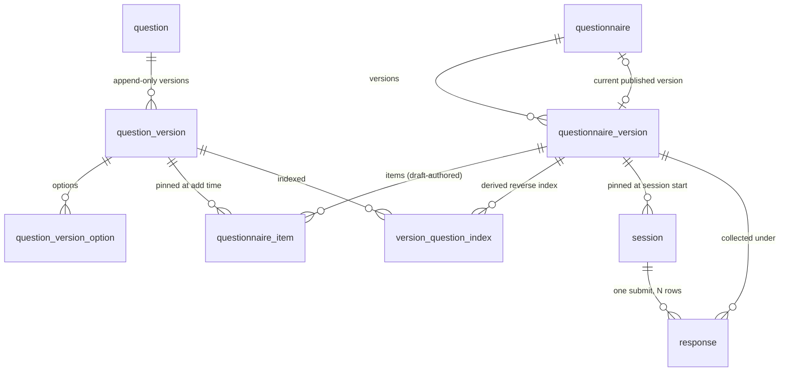

# Database Schema

> The physical schema behind [[2-design-doc#12. Database]]: tables, constraints, triggers, grants and migration mechanics. The decisions are made elsewhere: [[5-questionnaire-format#6. Versioning mechanics]] for versioning, [[7-application-boundary#3.2 Database grants]] for the boundary, [[6-observability#5. Audit trail]] for audit, [[3-scaling]] for partitioning. This doc is where they become DDL.
>
> Core tables are shown inline. Every other table's DDL is in the [[#Appendix|Appendix]]. The source of truth is `apps/backend/src/db/schema.ts` and `apps/backend/drizzle/`; a drift test fails if the two disagree.

## 1. Shape

### Schemas

| Schema | Holds | Written by |
| --- | --- | --- |
| `definition` | Question bank, questionnaires and their versions, draft items, `version_question_index` | `qp_definition` |
| `execution` | `session`, `response` | `qp_execution` |
| `audit` | One append-only `event` table | `audit.record` only |
| `monitor` | `SECURITY DEFINER` functions that return aggregates for telemetry, and nothing else | `qp_owner` at migration time; read by `qp_monitor` |

- Schemas make the definition/execution barrier structural. `ALTER DEFAULT PRIVILEGES IN SCHEMA definition` denies every authoring table added later to `qp_execution` without anyone remembering to.
- A per-table grant list can't do that. `GRANT ... ON ALL TABLES IN SCHEMA` covers only the tables that exist when it runs, and the miss shows up at runtime as `permission denied`, not at migration time.

### Relationships



- `audit.event` has no foreign keys, so it survives anything it describes.
- Every foreign key is `ON DELETE NO ACTION`. Nothing cascades; published data is never deleted, and drafts are removed by explicit statements.
- Several keys are composite on purpose. They are how the database refuses to reference a draft, and they are covered in [[#2. `definition`]] and [[#4. `execution`]].

### Conventions

- **`timestamptz` everywhere**, never `timestamp`.
- **snake_case columns**, through Drizzle's `casing: 'snake_case'`.
- **UUIDv7 primary keys, generated in the application.** Postgres 16 has no `uuidv7()`, and an extension isn't worth it. Time-ordered ids give index locality on `response`, the only table with write volume.
- **Two exceptions to v7.**
  - `execution.session.id` is UUIDv4. It is a bearer capability ([[7-application-boundary#7. Access model and data barriers]]) and should carry no ordering signal or creation time.
  - `audit.event.id` is v4, generated by the database (`gen_random_uuid()`), because `audit.record` is the only writer.
- **`item_id` and `option_id` are authored `text` keys**, not uuids. They appear inside snapshots and stored responses, and people read both when something goes wrong. `question_id` is a uuid because a question is a bank row, not a key inside a document. `question.key` is not carried into the snapshot ([[12-decisions-log]] #35).

### Rows or JSONB

**Anything a rule or a stored response can reference by id gets a row. Everything else is a validated document.**

- `question_id`, `option_id` and `item_id` are columns with keys and foreign keys.
- `minLength`, `min`/`max`, `numberKind`, `unit`, `multiline` and `relative` share one `constraints jsonb` column. They are a per-type union with no identity across versions, and nothing points at them.
- `visible_when` is JSONB for the same reason: a predicate is a value, not an entity. Publish-time validation ([[5-questionnaire-format#5. Publish-time validation]]) is application code either way.

See Decisions Log #35.

## 2. `definition`

> The core tables are below. `question`, `question_version_option`, `questionnaire_item` and `version_question_index` are in [[#A. `definition`|Appendix A]].

### Questionnaires

```sql
CREATE TABLE definition.questionnaire (
  id                 uuid PRIMARY KEY,
  key                text UNIQUE,              -- slug for seeds and admin URLs
  name               text NOT NULL,            -- admin-facing label; mutable, never snapshotted
  closes_at          timestamptz,              -- the one nullable field behind retirement
  current_version_id uuid,
  current_version    int,
  created_at         timestamptz NOT NULL DEFAULT now(),
  CONSTRAINT current_version_pair CHECK ((current_version_id IS NULL) = (current_version IS NULL))
);

CREATE TABLE definition.questionnaire_version (
  id               uuid PRIMARY KEY,
  questionnaire_id uuid NOT NULL REFERENCES definition.questionnaire(id),
  version          int CHECK (version >= 1),   -- NULL while draft; assigned at publish
  status           text NOT NULL CHECK (status IN ('draft','published')),
  title            text NOT NULL,
  snapshot         jsonb,
  format_version   int,
  created_by       text,
  created_at       timestamptz NOT NULL DEFAULT now(),
  updated_at       timestamptz NOT NULL DEFAULT now(),  -- display only, never the ETag
  draft_revision   int NOT NULL DEFAULT 0,              -- the ETag's source of truth
  published_at     timestamptz,
  CONSTRAINT version_state CHECK (
    (status='draft'     AND version IS NULL     AND snapshot IS NULL     AND format_version IS NULL
                        AND published_at IS NULL)
 OR (status='published' AND version IS NOT NULL AND snapshot IS NOT NULL AND format_version IS NOT NULL
                        AND published_at IS NOT NULL)),
  CONSTRAINT qv_addressable UNIQUE (questionnaire_id, id, version)
);

CREATE UNIQUE INDEX questionnaire_one_draft
  ON definition.questionnaire_version (questionnaire_id) WHERE status = 'draft';
CREATE UNIQUE INDEX questionnaire_version_number
  ON definition.questionnaire_version (questionnaire_id, version);

-- added afterwards: questionnaire_version did not exist when questionnaire was created
ALTER TABLE definition.questionnaire
  ADD CONSTRAINT questionnaire_current_version_fk
  FOREIGN KEY (id, current_version_id, current_version)
  REFERENCES definition.questionnaire_version (questionnaire_id, id, version);
```

- `name` is the admin's label and can be corrected without publishing. The respondent-facing `title` is versioned, sits on the version row, and is inside the snapshot.
- `version_state` makes draft and published two different shapes. A published row without a snapshot is not a state the table can hold.
- `format_version` is a column, not a key inside the snapshot, so "which snapshot formats are still live" is a query over a column and doesn't deserialize every snapshot.
- `questionnaire_one_draft` is what limits a questionnaire to one open draft.
- `draft_revision` is what the draft ETag is built from. Every draft mutation increments it in the same transaction, and `PUT /draft` compares `If-Match` against it ([[7-application-boundary#4.1 Endpoints]]). `updated_at` only feeds "edited three minutes ago", because two writes in one millisecond compare equal and a concurrency check can't depend on a clock. Both freeze at publish.

### The published-only guard

**What we're protecting.** Two places store "the version to use":

- `questionnaire.current_version_id` is the version a new respondent is served.
- `session`'s pinned version is the version a respondent's answers are collected under.

Both must point at **a published version of the same questionnaire**. Two mistakes would be serious:

- **Pointing at a draft.** A respondent would answer questions that are still being edited.
- **Pointing at another questionnaire's version.** A respondent would be served the wrong questionnaire.

**Why an ordinary foreign key isn't enough.** A foreign key to `questionnaire_version(id)` only proves the row exists. A draft exists, and so does another questionnaire's version, so both would pass.

**The idea.** Have the database check three things together instead of one: the questionnaire, the version row and the version number. This works because a draft has no version number until it is published, so "has a number" and "is published" are the same fact. Checking the number checks the status without ever reading `status`.

**How.** `qv_addressable` makes the triple `(questionnaire_id, id, version)` unique, and the foreign key must match an existing triple. A pointer therefore has to supply all three values.

Take these rows:

| id | questionnaire | version | status |
| --- | --- | --- | --- |
| `aaa` | intake | 1 | published |
| `bbb` | intake | 2 | published |
| `ccc` | intake | none | draft |
| `ddd` | onboarding | 1 | published |

Here is what intake can point at:

| Intake points at | Triple it forms | Result |
| --- | --- | --- |
| `bbb`, its own v2 | `(intake, bbb, 2)`, which exists | Accepted |
| `ccc`, its own draft | `ccc` has no number, so any number written forms a triple that exists nowhere | Rejected |
| `ddd`, onboarding's v1 | `(intake, ddd, 1)`, but `ddd` belongs to onboarding | Rejected |

**What follows from it.**

- `current_version_id` is paired with `current_version` because the foreign key needs a value for every column it matches. `id` supplies the questionnaire, and these two supply the rest.
- `current_version_pair` requires both to be set or both null. With `MATCH SIMPLE`, Postgres skips the check while they are null, which is right for a questionnaire with nothing published yet.
- `execution.session` has the same foreign key ([[#4. `execution`]]), so a session can't pin a draft either.
- Serving a draft or the wrong questionnaire is now a write the database refuses, not a bug a reviewer has to catch.

### The circular foreign key

`questionnaire` points at `questionnaire_version` through `current_version_id`, and `questionnaire_version` points back at `questionnaire`. Two tables that reference each other look wrong at first, but it works here.

The usual problem with a cycle is that neither row can be inserted first. That doesn't happen because `current_version_id` is nullable. A questionnaire starts with no current version, and the pointer is filled in when its first version is published. Ownership also runs one way: a version belongs to its questionnaire, and the pointer only says which one is current. The one real cost is that the constraint has to be added with `ALTER TABLE` once both tables exist.

We could drop the pointer and work out the current version as the highest published number. We keep it for three reasons:

- Starting a session becomes a single lookup, not an aggregate.
- `(questionnaire_id, version)` is the key [[3-scaling#4. Problem: hot definition reads]] caches on.
- A stored pointer can name a version other than the newest, for a rollback or a scheduled publish. A computed maximum can't.

### Questions

```sql
CREATE TABLE definition.question_version (   -- append-only
  question_id uuid NOT NULL REFERENCES definition.question(id),
  version     int  NOT NULL CHECK (version >= 1),
  type        text NOT NULL CHECK (type IN
                ('text','single_choice','multiple_choice','number','date')),
  prompt      text NOT NULL,
  constraints jsonb NOT NULL DEFAULT '{}'::jsonb,
  created_by  text,
  created_at  timestamptz NOT NULL DEFAULT now(),
  PRIMARY KEY (question_id, version)
);
```

- The bank is `question` (identity and archive flag), `question_version` (content) and `question_version_option` (the options of one version). Versions are append-only ([[#3. Immutability and publish]]), and questions are archived, never deleted (Decisions Log #13, #15).
- There is no `yes_no` type. A yes/no question is a `single_choice` with two options, seeded by an editor template with the ids `yes` and `no`. The schema doesn't enforce those ids (Decisions Log #36).

Options carry their own ids, and two rules about those ids are worth knowing.

- **Option ids stay the same across versions.** If an author edits a question and changes an option's label, the option keeps its id, so answers collected under version 1 and version 2 can still be counted together ([[5-questionnaire-format#2.1 Option ids are stable across question versions]]). The database doesn't enforce this; the editor copies ids forward into the next version.
- **The id `other` is reserved for the freeform option.**
  - A question can offer an "Other" choice where the respondent types their own text ([[5-questionnaire-format#2.3 The `other` option]]).
  - That option always has the id `other`, and rules and stored responses refer to it by that name.
  - `freeform_exactly_when_other` keeps the `freeform` flag and the id in step: an option is freeform exactly when its id is `other`.
  - Without it, a freeform option with some other id could never carry text, and a plain option named `other` would wrongly accept it (Decisions Log #83).
  - Every freeform row then has the id `other`, so the primary key already allows at most one per version.

### Items and the reverse index

- `questionnaire_item` places a question in a version. It pins `(question_id, question_version)` with a composite foreign key, so an item can't reference a version that doesn't exist, and because question versions are never deleted it can't dangle ([[5-questionnaire-format#6.2 Question identity and versioning]]).
- **Item rows stay after publish.** The next draft is an explicit copy of the latest published version ([[5-questionnaire-format#6.1 Questionnaire versions]]), and copying rows avoids a snapshot-deserialize path to get wrong. The snapshot stays authoritative. `promote_draft` checks it against the item rows at publish ([[#3. Immutability and publish]]).
- **`item_position_unique` is `DEFERRABLE INITIALLY IMMEDIATE`.** A reorder is a set of position updates that is unique only once the statement finishes. Ordinary writes check immediately, and a reorder can `SET CONSTRAINTS ... DEFERRED`. `replaceDraft` currently deletes and reinserts a draft's items instead, so the app doesn't use the deferral.
- `version_question_index` answers "which published versions contain question X?" It is derived from the snapshot at publish and rebuildable from the snapshots. `vqi_reverse` serves the lookup.

See Decisions Log #13, #15, #36, #83.

## 3. Immutability and publish

> The database is layer one of the three-layer enforcement in [[5-questionnaire-format#6.4 Three layers of immutability enforcement]].

### Published rows can't change

```sql
CREATE FUNCTION definition.reject_mutation() RETURNS trigger LANGUAGE plpgsql AS $$
BEGIN
  RAISE EXCEPTION 'row is published and immutable' USING ERRCODE = 'QP001';
END $$;

CREATE TRIGGER qv_immutable_update BEFORE UPDATE ON definition.questionnaire_version
  FOR EACH ROW WHEN (OLD.status = 'published') EXECUTE FUNCTION definition.reject_mutation();
CREATE TRIGGER qv_immutable_delete BEFORE DELETE ON definition.questionnaire_version
  FOR EACH ROW WHEN (OLD.status = 'published') EXECUTE FUNCTION definition.reject_mutation();
CREATE TRIGGER qv_immutable_insert BEFORE INSERT ON definition.questionnaire_version
  FOR EACH ROW WHEN (NEW.status = 'published') EXECUTE FUNCTION definition.reject_mutation();
```

- **`UPDATE`.** The `UPDATE` that promotes a draft is allowed, because the trigger checks `OLD.status`, which is still `draft`.
- **`DELETE`.** Deleting a published version would destroy the definition its responses are rendered against, which is the same failure as editing it. It also breaks the no-deletion rule in [[2-design-doc#3. Constraints]].
- **`INSERT`.** Without it, a row inserted already `published` with a complete snapshot would satisfy `version_state`, and only its items would be refused. With it, a published row can only come from promoting a draft in place (Decisions Log #8, #46).
- **Question versions** get the blunt form: `question_version` and `question_version_option` reject every `UPDATE` and `DELETE`, with no condition. That is what append-only means as a database guarantee.

### Items cannot be reparented

Item rows need their own guard, or a published version's items stay editable behind the version row's back.

```sql
CREATE FUNCTION definition.reject_item_mutation() RETURNS trigger LANGUAGE plpgsql AS $$
DECLARE parent_status text;
BEGIN
  IF TG_OP = 'UPDATE' AND NEW.questionnaire_version_id <> OLD.questionnaire_version_id THEN
    RAISE EXCEPTION 'items cannot be reparented' USING ERRCODE = 'QP001';
  END IF;
  SELECT status INTO parent_status FROM definition.questionnaire_version
   WHERE id = COALESCE(NEW.questionnaire_version_id, OLD.questionnaire_version_id)
   FOR SHARE;
  IF parent_status = 'published' THEN
    RAISE EXCEPTION 'questionnaire version is published and immutable' USING ERRCODE = 'QP001';
  END IF;
  RETURN COALESCE(NEW, OLD);
END $$;

CREATE TRIGGER item_immutable BEFORE INSERT OR UPDATE OR DELETE ON definition.questionnaire_item
  FOR EACH ROW EXECUTE FUNCTION definition.reject_item_mutation();
```

Two details keep the obvious version of this trigger from failing:

- **`FOR SHARE`, not a bare `SELECT`.** Without the lock, the check races with a publish:
  1. A publish transaction reads the items, writes the snapshot and flips the status, but hasn't committed.
  2. Another connection inserts an item. It sees `draft` and commits.
  3. The published snapshot lists one item, the item rows number two, and no error was raised.

  With `FOR SHARE`, the insert waits for the publish to commit, re-reads the status and is rejected.
- **The reparent check.** The trigger only looks at one parent. Without the check, `UPDATE questionnaire_item SET questionnaire_version_id = <draft>` would move an item out of a published version.

Deleting an item is part of editing a draft, so `qp_definition` holds `DELETE` on `questionnaire_item` and no other table (Decisions Log #45). This guard bounds it: deleting an item whose parent is published is `QP001`.

### `QP001`

`QP001` is a custom SQLSTATE that reaches the client intact through `pg`. It is mapped to `409` in one place, `modules/definition/errors.ts`. The API returns `409` because the database said `QP001`, not because a service check happened to run first ([[7-application-boundary#6.2 Status codes]]).

### Publishing goes through `promote_draft`

**The problem.** The triggers stop a published row from changing. They don't stop a draft from being published the wrong way. If `qp_definition` could set `status = 'published'` itself, it could attach any snapshot, skip validation and leave the reverse index empty.

**The fix.** Publishing is one database function, `definition.promote_draft`.

- `qp_definition` can't publish by hand. It may only update the columns an editor needs: `title`, `draft_revision` and `updated_at` on `questionnaire_version`, and `key`, `name` and `closes_at` on `questionnaire`. Status, version number, snapshot and the current-version pointer are off limits ([[#7. Roles and grants]]).
- The function runs with its owner's privileges (`SECURITY DEFINER`, owned by `qp_owner`), and only `qp_definition` can call it.

**What the function does.** The application passes it the draft's id and the snapshot it built. The function then:

1. Locks the draft and checks it is still a draft.
2. Checks the snapshot matches the draft: it names this questionnaire and its next version number, and lists exactly the draft's items, in order, with the same pinned question versions.
3. Records which question versions this version uses, in `version_question_index`.
4. Marks the row published and stores the snapshot.
5. Points the questionnaire's current version at it.

If a check fails, nothing is written. A published version raises `QP001`, a snapshot that doesn't match the draft raises `22023`, and an unknown version raises `P0002`.

**Who does what.**

- **The application** validates the draft, builds the snapshot and writes the audit row. Validation is `validateDraft` in `@qp/shared`, the same function `POST /draft/validate` calls ([[5-questionnaire-format#5. Publish-time validation]]). It stays there because putting it in SQL would create a second implementation.
- **The database** makes sure that what gets published is consistent. It can't judge branching rules, but it refuses a snapshot that isn't structurally the draft it is promoting.
- **The audit row** is written right after the function returns, in the same transaction. If the audit write fails, the publish rolls back ([[6-observability#5.1 Isolation — separate schema with a restricted role]]).

**The known gap.** Code that holds `qp_definition` can still publish a draft that skipped validation, or call `promote_draft` directly and publish with no audit row. This was accepted on purpose (Decisions Log #51). Closing it would mean giving `qp_owner` a path into `audit`, or making the audit role own a function that writes definitions. So audit completeness for publish rests on `publishDraft` being the only caller, as it does for every other authoring action.

### Row locks

Some operations must not run at the same time on the same row. Each one below is prevented by locking the row first, so the second caller waits, rather than by retrying.

| Race | What goes wrong | Lock |
| --- | --- | --- |
| Publish and create-next-draft | A publish to v2 hasn't committed, so the new draft is copied from v1. Publishing it as v3 silently drops v2, and nothing raises an error. | The `questionnaire` row, first thing in publish, create-draft and retire |
| Two saves of one question | Both work out the same next version number, and one fails with a raw duplicate-key error. | The `question` row, before the next version number is computed. A duplicate key on that path also returns `409`. |
| Two publishes of one draft | Nothing. `promote_draft` re-checks under its own lock, so only one succeeds. | None needed |

The first race is the one that matters. It is the only one that corrupts data instead of raising an error.

Publish takes its locks in this order:

1. The questionnaire row, which blocks create-draft and retire.
2. The draft version row, which makes the item trigger wait instead of reading a stale status.
3. In the application: read the items, build the snapshot and validate.
4. `promote_draft`, whose own lock on the version row is already held.
5. The audit row.

See Decisions Log #8, #45, #46, #51.

---

## 4. `execution`

> Two tables. A `session` is one respondent's attempt, pinned to a published version. A `response` is one answered item, written when the session is submitted. Indexes are in [[#5. Indexes]].

### Sessions

```sql
CREATE TABLE execution.session (
  id                       uuid PRIMARY KEY,          -- v4: bearer capability
  questionnaire_id         uuid NOT NULL,
  questionnaire_version_id uuid NOT NULL,
  version                  int  NOT NULL,
  status                   text NOT NULL CHECK (status IN ('in_progress','submitted')),
  started_at               timestamptz NOT NULL DEFAULT now(),
  last_activity_at         timestamptz NOT NULL DEFAULT now(),
  submitted_at             timestamptz,
  response_digest          bytea,
  FOREIGN KEY (questionnaire_id, questionnaire_version_id, version)
    REFERENCES definition.questionnaire_version (questionnaire_id, id, version),
  CONSTRAINT session_pinned_version_key UNIQUE (id, questionnaire_version_id),
  CONSTRAINT session_state CHECK (
    (status='in_progress' AND submitted_at IS NULL     AND response_digest IS NULL)
 OR (status='submitted'   AND submitted_at IS NOT NULL AND response_digest IS NOT NULL))
);
```

- **Lifecycle.** `status` and `session_state` together allow only `in_progress → submitted` ([[7-application-boundary#5.3 Session lifecycle]]). Abandonment is just the absence of a submit, so it has no column.
- **The pinned version.** The composite foreign key is the published-only guard from [[#2. `definition`]], so a session can't pin a draft. `session_pinned_version_key` exists so `response` can reference the pin (see [[#Foreign keys|Foreign keys]], below).
- **`response_digest`** is what makes submit idempotent. It is a SHA-256 over the canonicalized answers, written at first submit ([[7-application-boundary#5.4 Submit: authority, validation, idempotency]], Decisions Log #19).
  - A retried submit recomputes the digest from its answers. A match returns the original receipt, and a mismatch is a conflict.
  - There is no idempotency-key table, because the session is the key.
  - The digest is a pure function of the stored `response` rows, so changing the canonical form later is a backfill. Don't fold anything that isn't persisted into it.
- **Timestamps come from the application.** `startSession` and `markSubmitted` write `started_at`, `last_activity_at` and `submitted_at` themselves, as millisecond values. The `DEFAULT now()` writes microseconds, which don't match the millisecond cursor of the admin responses list (Decisions Log #88, #90). The schema doesn't enforce this, so a row that took the default could be skipped or repeated across a page boundary. This is a known gap ([gh#120](https://github.com/kenziesimpson/questionnaire-platform/issues/120)).
- **Not partitioned.** Partitioning `session` would cost more than it gives.
  - **Resume would be slower.** A respondent resuming has only a session id, with no date in it. A primary key on a partitioned table must include the partition key, so a lookup by `id` alone would check every partition instead of one.
  - **`response` couldn't reference it.** A foreign key needs a unique constraint on its target, and that constraint would have to include the partition key. The pinned-version key from above could not exist.
  - **The gain is small.** A session is one row per respondent, not one per answer, so the table grows slowly. Archiving old sessions is a move job, not a `DETACH`.

### Responses

```sql
CREATE TABLE execution.response (
  id                       uuid NOT NULL,
  created_at               timestamptz NOT NULL,      -- no default; see Partitioning
  session_id               uuid NOT NULL REFERENCES execution.session(id),
  questionnaire_version_id uuid NOT NULL REFERENCES definition.questionnaire_version(id),
  item_id                  text NOT NULL,
  question_id              uuid NOT NULL,             -- what you aggregate on
  question_version         int  NOT NULL,             -- what you render with
  question_type            text NOT NULL,
  text_value   text,
  number_value numeric,
  number_unit  text,
  date_value   date,
  option_ids   text[],
  other_text   text,
  PRIMARY KEY (id, created_at),
  FOREIGN KEY (session_id, questionnaire_version_id)
    REFERENCES execution.session (id, questionnaire_version_id),
  CONSTRAINT response_shape CHECK (COALESCE(
    CASE question_type
      WHEN 'text' THEN text_value IS NOT NULL AND text_value <> ''
        AND option_ids IS NULL AND number_value IS NULL AND date_value IS NULL AND other_text IS NULL
      WHEN 'number' THEN number_value IS NOT NULL
        AND text_value IS NULL AND option_ids IS NULL AND date_value IS NULL AND other_text IS NULL
      WHEN 'date' THEN date_value IS NOT NULL
        AND text_value IS NULL AND option_ids IS NULL AND number_value IS NULL AND other_text IS NULL
      WHEN 'single_choice' THEN option_ids IS NOT NULL AND cardinality(option_ids) = 1
        AND array_position(option_ids, NULL) IS NULL
        AND text_value IS NULL AND number_value IS NULL AND date_value IS NULL
      WHEN 'multiple_choice' THEN option_ids IS NOT NULL AND cardinality(option_ids) >= 1
        AND array_position(option_ids, NULL) IS NULL
        AND text_value IS NULL AND number_value IS NULL AND date_value IS NULL
      ELSE false END, false)),
  CONSTRAINT other_text_needs_other CHECK (
    other_text IS NULL OR (option_ids IS NOT NULL AND 'other' = ANY(option_ids))),
  CONSTRAINT number_unit_needs_value CHECK (number_unit IS NULL OR number_value IS NOT NULL)
) PARTITION BY RANGE (created_at);
```

- **What a row holds.** The columns are what [[5-questionnaire-format#6.3 What a response stores]] specifies. `question_id` is what you aggregate on, `question_version` is what you render with, and `questionnaire_version_id` is the route to the snapshot. The value is stored in a form that doesn't depend on labels.
- **Responses are write-once.** Rows are inserted at submit and never changed ([[#7. Roles and grants]]).

**Why typed columns, not one `value jsonb`:**

- **Counting choices is an index lookup.** "How many respondents chose `opt_diabetes`" can use a GIN index on `option_ids`, where a JSONB blob would need a sequential scan and a cast. This is future-proofing for response aggregation.
- **Numbers keep their exact value and unit.** `numeric` doesn't round, unlike `double precision`, and it preserves scale, so the submit validator writes the canonical decimal (`72.5`, and `0` for `-0`). That keeps the stored value in agreement with the digest. `number_unit` sits beside it as its own column ([[12-decisions-log]] #12).
- **An invalid shape can't be stored.** The `CASE` in `response_shape` does at the database layer what the branching types do in code ([[5-questionnaire-format#4.2 Conditions are typed per response type]]).
- **`date_value` is a `date`, not a `timestamptz`.** A date question collects a calendar date, and a timezone would invent precision the respondent never gave.

The cost is that a sixth response type is a migration, not a code change. At five types fixed by the brief, that is the right trade.

### The `response_shape` check

A `CHECK` passes when its expression is NULL, and NULL spreads through comparisons: `cardinality(NULL) = 1` is NULL, not false. So the obvious version of this check lets four bad rows through:

| Attempted row | Why it slipped through |
| --- | --- |
| `single_choice` with `option_ids = NULL` | `cardinality(NULL) = 1` is NULL, so the check passes |
| `multiple_choice` with `option_ids = NULL` | Same |
| `single_choice` with `ARRAY[NULL]` | The cardinality is 1, and the element is never inspected |
| `text` with `''` | `'' IS NOT NULL` is true |

The fix is the outer `COALESCE(..., false)`, plus the explicit `IS NOT NULL`, `array_position(option_ids, NULL) IS NULL` and `text_value <> ''` guards. With them, all four are rejected and valid rows still insert.

**One shape is left open: duplicate ids inside `option_ids`.** A `CHECK` can't contain a subquery, and de-duplicating an array needs one, so closing it in the database would take an `IMMUTABLE` helper function.

- The application validates it instead. The submit validator already walks `option_ids` to check each id against the pinned question, so uniqueness is one more line there, and it returns a `422` naming the item (Decisions Log #34).
- It only affects `multiple_choice`, because `single_choice` is capped at one element.
- The harm is specific. `'opt_x' = ANY(option_ids)` still counts a row once, but `GROUP BY unnest(option_ids)`, the "how many chose each option" query, counts the duplicate twice.
- Adding the helper later is one custom migration and no application change ([[2-design-doc#18. Future Work]]).

### Foreign keys

`response` has three: `session_id` to `session`, `questionnaire_version_id` to `questionnaire_version`, and the pair of them to the session's pin. Nothing else.

- **The pair.** The two single-column keys hold independently, so a response on a session pinned to v1 could carry another questionnaire's version, or a draft's, and insert cleanly. `(session_id, questionnaire_version_id)` referencing `session (id, questionnaire_version_id)` means a response can't claim a version its session didn't pin (Decisions Log #49). The key stays inside `execution`.
- **No key into authoring tables.** A foreign key on `(questionnaire_version_id, item_id)` into `questionnaire_item` would validate more, and Postgres allows it. It is left out because execution never reaches into an authoring table ([[7-application-boundary#2.1 What execution is structurally denied]]). `questionnaire_version` is what crosses the boundary, so a key to it fits. Whether an item or question version is valid is the submit-time rule engine's job, checked against the snapshot.

### Partitioning

`response` is range-partitioned monthly on `created_at`, with no `DEFAULT` partition.

```sql
CREATE TABLE execution.response_2026_09 PARTITION OF execution.response
  FOR VALUES FROM ('2026-09-01') TO ('2026-10-01');
-- ... one per month
```

- **Who creates partitions.** Migration `0004` creates 36 months from 2026-09. `ensureResponsePartitions` (`db/partitions.ts`) runs on every migrate and tops up 24 months ahead. An alert fires when fewer than one month remains ([[6-observability]]).
- **A missed month fails loudly.** An insert with no partition is an error, which is recoverable. That is the point of having no default partition.

**Why no default partition.** A default looks like cheap insurance against a missed month, but it breaks the two operations partitioning is for:

- `DETACH PARTITION ... CONCURRENTLY` is refused while a default partition exists. Archiving ([[3-scaling#3. Problem: response ingest vs. reads]]) would then lock the hot table.
- Attaching a new partition while the default holds rows in its range is a hard error. The rows have to be moved out first, under load.

**`created_at` is set explicitly, never defaulted.** Submit uses one timestamp for `session.submitted_at` and for every response row's `created_at`.

- All of a session's rows are therefore in one partition, because they share one literal value, not because `now()` happens to be transaction-scoped.
- A read that knows the session's `submitted_at` can filter on it and touch a single partition.

**There is no unique index on `(session_id, item_id)`.** A unique index on a partitioned table must contain the partition key, so it couldn't be global. One that only held within a partition would look like a guarantee without being one. The real guarantee is `FOR UPDATE` on the session row plus the `in_progress → submitted` transition, which makes a second write impossible.

See Decisions Log #19, #34, #49, #88, #90.

---

## 5. Indexes

Every index below exists for a named query or a named invariant.

| Index | Serves |
| --- | --- |
| `questionnaire_one_draft` | The one-draft-per-questionnaire invariant. Not an access path. |
| `questionnaire_version_number` | Looking up a version by number, and its uniqueness. |
| `qv_addressable` | The published-only foreign keys ([[#2. `definition`]]). |
| `vqi_reverse` | "Which published versions contain question X." |
| `session` primary key | Resume, `GET /sessions/:sessionId`, a point lookup. |
| `session_by_version` | "Sessions started against version N," for republishing and analytics. |
| `session_by_questionnaire` and the two `submitted_asc`/`_desc` indexes | The admin responses list, keyset-paged by Started or by Submitted, in either direction. Two indexes are needed for Submitted because in-progress sessions have a `NULL` there, and a btree scanned backward reverses where `NULL`s sort — one index can't serve both directions. The full reasoning is in Decisions Log #90. |
| `session_in_progress` (partial) | Abandonment analytics. Reserved; not yet read by application code. |
| `session_pinned_version_key` | What `response`'s composite foreign key targets ([[#4. `execution`]]). An invariant, not an access path. |
| `response_by_session` | Reporting reads over one session's answers, with partition pruning. |
| `response_by_question` and `response_by_option` (GIN) | Per-question and per-option analytics. Reserved; not yet read by application code. |

Deliberately **not** indexed:

- **No GIN index on `snapshot`.** It's read whole, by design, and `version_question_index` already answers the one query that would otherwise want one.
- **No index on `closes_at`.** It's checked on a row already fetched by primary key, and the questionnaire count is in the dozens.
- **No index on `question.archived_at`.** Same reason: the bank is small, and the picker reads all of it.

### Read and write patterns

The two schemas have close to opposite profiles.

- **`definition` — small, hot reads, rare careful writes.** Row counts are in the dozens to hundreds. Writes are multi-statement transactions with row locks ([[#3. Immutability and publish]]) and are optimized for correctness, not speed. Reads look hot but mostly aren't: starting a session reads `questionnaire` once and the published snapshot once, and after that the definition is held in an in-process cache that never needs invalidating ([[3-scaling#4. Problem: hot definition reads]]).
- **`execution.response` — large, append-only, bulk writes, lagging reads.** One burst of rows per completed session, never updated or deleted. Reads are analytics: cross-session, tolerant of lag, and the first candidate for a read replica.
- **`execution.session` — the only contended row, and only with itself.** A read-modify-write per session, point lookups by primary key, and a `FOR UPDATE` at submit. Two respondents never touch the same row.

That split is why exactly one table is partitioned, exactly one column has a GIN index, and the concurrency budget is spent on the definition side.

---

## 6. `audit`

> One append-only table, written through one function, by two roles.

### The event table

```sql
CREATE TABLE audit.event (
  id                       uuid PRIMARY KEY DEFAULT gen_random_uuid(),  -- its own id
  occurred_at              timestamptz NOT NULL DEFAULT now(),          -- its own timestamp
  actor_type               text NOT NULL DEFAULT 'system',
  actor_id                 text,
  action                   text NOT NULL CHECK (action IN
                             ('create_draft','edit_draft','publish','retire','reopen','archive_question','create_question_version','view_response')),
  questionnaire_id         uuid,
  questionnaire_version_id uuid,
  version                  int,
  summary                  jsonb,
  trace_id                 text
);
CREATE INDEX audit_by_questionnaire ON audit.event (questionnaire_id, occurred_at DESC);
```

- **No foreign keys, and its own id and timestamp**, rather than reusing the domain row's. The plan is to eventually move this table to its own database behind a transactional outbox ([[6-observability#5.1 Isolation — separate schema with a restricted role]]), and a foreign key into `definition` would have to be dropped to do that.
- **`trace_id`** links a row to the OpenTelemetry trace that produced it, without putting anything about a respondent's answers into either.

### The actions

| Action | Written when | Row also carries |
| --- | --- | --- |
| `create_draft` | A questionnaire's first draft is opened, or the next draft is copied from a published version | Questionnaire, new draft version |
| `edit_draft` | `PUT /draft` replaces a draft's items | Questionnaire, draft version |
| `publish` | A draft is promoted | Questionnaire, new published version |
| `retire` | `closes_at` is set | Questionnaire |
| `reopen` | `closes_at` is cleared | Questionnaire |
| `archive_question` | A question is archived | Nothing in the questionnaire columns — a question isn't tied to one. In `summary`, the question id |
| `create_question_version` | A question gets a new version | Same: `summary` holds the question id and its new version number |
| `view_response` | An admin opens a session's raw answers | Questionnaire, the session's pinned version, and in `summary` the session id only — never an answer |

Every row but the last is an authoring action, the kind an auditor would ask about. `view_response` is the one read that gets logged, because it's the one place a person, not a respondent, sees an answer.

### Writing through `audit.record`

An audit write has to satisfy two things that look like they conflict: it must go through a role dedicated to auditing, and it must be part of the same transaction as the change it records. A second connection could give the first and not the second.

A `SECURITY DEFINER` function owned by that dedicated role, `audit_owner`, gives both. `qp_definition` calls `audit.record(...)`; the function runs with `audit_owner`'s privileges, in the caller's own transaction. This makes the table append-only, structurally: `qp_definition` holds no privilege on `audit.event` directly, only `EXECUTE` on a function that only ever inserts, so a rollback that undoes the domain change undoes the audit row with it.

```sql
CREATE FUNCTION audit.record(p_action text, p_qid uuid, p_qvid uuid, p_version int,
                             p_actor_id text, p_summary jsonb, p_trace_id text)
RETURNS uuid LANGUAGE sql SECURITY DEFINER SET search_path = audit, pg_temp AS $$
  INSERT INTO audit.event (action, questionnaire_id, questionnaire_version_id,
                           version, actor_id, summary, trace_id)
  VALUES (p_action, p_qid, p_qvid, p_version, p_actor_id, p_summary, p_trace_id)
  RETURNING id;
$$;
```

- **`SET search_path = audit, pg_temp` is load-bearing.** A `SECURITY DEFINER` function without a pinned search path is a known Postgres privilege-escalation route: a caller could create a same-named object earlier on the path, and the function would run it with the owner's rights.
- **`EXECUTE` on a new function is granted to `PUBLIC` by default.** Migration `0014` revokes it here, in the same sweep it applies to every function in `definition`, `execution` and `audit`, so `qp_definition`'s own grant is the only one left. `0020` later grants `qp_reporting` `EXECUTE` too, for `view_response` (Decisions Log #89).

### One shape, for `qp_reporting`

`qp_definition` can call `audit.record` with any of the eight actions, because it's the role that performs every authoring change. `qp_reporting` only ever needs to write one of them, `view_response`, but its `EXECUTE` grant on the same function would otherwise let it record any action with any payload too — there's no separate, narrower function for it to call instead.

So migration `0022` adds a guard at the top of the function that applies only when `session_user = 'qp_reporting'`, and locks that role to exactly the one row shape it needs:

| The row must have | Because |
| --- | --- |
| `action = 'view_response'` | It's the only action this role is allowed to record |
| `summary` exactly `{"sessionId": "<uuid>"}` | No other field, and no other value, can go in it |
| Questionnaire id, version id and version all set | A `view_response` row must name what was viewed |
| `trace_id` null or 32 lowercase hex digits | The one valid form of an OpenTelemetry trace id |

A row failing any of these raises `42501` before anything is written. `qp_definition` and any other caller are unaffected — the guard only ever runs for `qp_reporting`.

- **`session_user`, not `current_user`.** Inside the function, `current_user` is always `audit_owner`, the owner, so it can't tell callers apart. `session_user` is the role the connection logged in as, and it doesn't change with `SET ROLE` or inside the function. This only holds because each role connects with its own credentials — a pooler that logged every caller in as one shared user would defeat the check.
- **This is an allow-list for one role, not a deny-list for the rest.** Any other role granted `EXECUTE` later can record anything. A catalog test fails if a role other than `qp_definition`, `qp_reporting`, `audit_owner` or a superuser holds `EXECUTE`, so a new grantee has to be a deliberate decision.
- **What it doesn't catch.** `actor_id` is free text the caller supplies, and the row's ids aren't checked to exist or belong together — `audit` has no foreign keys, by design. A compromised `qp_reporting` credential could still write a misleading row, though it could already read the answers it would be describing.

See Decisions Log #89.

---

## 7. Roles and grants

> Every table belongs to `qp_owner`. Four other roles connect from the application, each with only the privileges its job needs, and each enforced by a catalog test that fails if a grant drifts.

### Identities

```sql
ALTER DATABASE questionnaire_platform OWNER TO qp_owner;
GRANT audit_owner TO qp_owner WITH INHERIT FALSE;
```

| Role | Created by | Connects as |
| --- | --- | --- |
| Bootstrap superuser | `initdb`, at cluster creation | Only to run the roles script |
| `qp_owner` | The roles script | The `migrate` service |
| `qp_definition` | The roles script | The backend's authoring pool |
| `qp_execution` | The roles script | The backend's execution pool |
| `qp_reporting` | The roles script | The backend's reporting pool |
| `qp_monitor` | The roles script, a member of `pg_monitor` | The observability collector, not the backend |
| `audit_owner` | The roles script, `NOLOGIN` | Never — no password |

- **Roles aren't created by a migration.** A migration is committed to git, so it can't hold a password, and roles belong to the Postgres server, not to one database, so a per-database migration is the wrong place for them regardless. They're created by a shell script, `db/init/01-roles.sh`, which reads each password from the environment and is safe to run again: every `CREATE ROLE` is guarded, so an existing cluster is left alone and its passwords are simply reset.
- **The bootstrap superuser and `qp_owner` are different roles.** `initdb` makes the bootstrap user a superuser, and that isn't configurable. Making it `qp_owner` too would mean the identity that runs on every `docker compose up` also has cluster-wide power. `qp_owner` owns every object instead — enough to create and manage them — and never logs in as anything more.
- **`qp_owner` needs `audit_owner`'s membership** because `ALTER ... OWNER TO` requires it, and `audit.event` and `audit.record` are owned by `audit_owner` ([[#6. `audit`]]). `WITH INHERIT FALSE` means `qp_owner` must `SET ROLE` to use it, rather than holding `audit_owner`'s privileges by default.

### What each role can do

```sql
GRANT SELECT, INSERT, UPDATE ON ALL TABLES IN SCHEMA definition TO qp_definition;
REVOKE UPDATE ON definition.questionnaire_version, definition.questionnaire FROM qp_definition;
GRANT  UPDATE (title, draft_revision, updated_at) ON definition.questionnaire_version TO qp_definition;
GRANT  UPDATE (key, name, closes_at)              ON definition.questionnaire         TO qp_definition;
GRANT  DELETE  ON definition.questionnaire_item TO qp_definition;
GRANT  EXECUTE ON FUNCTION definition.promote_draft(uuid, jsonb) TO qp_definition;
GRANT  EXECUTE ON FUNCTION audit.record(...)    TO qp_definition;

CREATE VIEW definition.published_questionnaire_version WITH (security_barrier = true) AS
  SELECT id, questionnaire_id, version, title, snapshot, format_version, published_at
    FROM definition.questionnaire_version WHERE status = 'published';

GRANT SELECT ON definition.questionnaire, definition.published_questionnaire_version,
                definition.version_question_index TO qp_execution;
GRANT SELECT, INSERT, UPDATE ON execution.session  TO qp_execution;
GRANT SELECT, INSERT         ON execution.response TO qp_execution;

GRANT SELECT ON execution.session, execution.response TO qp_reporting;
GRANT SELECT ON definition.published_questionnaire_version TO qp_reporting;
GRANT SELECT (id) ON definition.questionnaire TO qp_reporting;
GRANT EXECUTE ON FUNCTION audit.record(...) TO qp_reporting;  -- restricted to view_response, §6
```

| Role | `definition` | `execution` | `audit` |
| --- | --- | --- | --- |
| `qp_definition` | Read and write every table. `UPDATE` on `questionnaire` and `questionnaire_version` is limited to the columns above — publishing happens only through `promote_draft`. `DELETE` on `questionnaire_item` only. | None. | `EXECUTE` on `audit.record`, unrestricted. |
| `qp_execution` | Read `questionnaire`, `version_question_index`, and published versions through the view — never the base `questionnaire_version` table, which would expose drafts. | Read and write `session`. Read and insert `response`, never update or delete it. | None. |
| `qp_reporting` | Read published versions through the same view, and only the `id` column of `questionnaire`. | Read `session` and `response`, nothing else. | `EXECUTE` on `audit.record`, restricted to `view_response` ([[#6. `audit`]]). |
| `qp_monitor` | None. | None. | None. |
| `qp_owner` | Owns everything. | Owns everything. | None — ownership of `audit` sits with `audit_owner`. |

Three things worth calling out:

- **`qp_definition` has no access at all to `execution.response`.** The authoring surface is not a way to read answer data. Likewise `qp_execution` and `qp_reporting` have no way to update or delete a response once it's written — collected answers are as immutable as published definitions, just enforced by a grant instead of a trigger.
- **`qp_execution` reads through `published_questionnaire_version`, not the base table.** `SELECT` on `questionnaire_version` directly would also expose draft rows — their title, who created them, their revision counter — which execution should never see. The view is `security_barrier`, so a query can't smuggle a predicate past it to peek at a draft anyway.
- **The only `DELETE` any application role holds is `qp_definition` on `questionnaire_item`**, needed to remove an item from a draft, and confined to drafts by the item trigger ([[#3. Immutability and publish]]). Nothing published, collected, or audited can be deleted through the application.

`qp_reporting` exists because the admin responses browser needs to read across `definition` and `execution` without holding either role's write privileges. It is not `qp_execution` under another name, and not a wider `qp_definition` grant — it is `SELECT` only, on exactly the tables above, plus the one narrow write through `audit.record`.

See Decisions Log #45, #48, #89.

### `qp_monitor` and the `monitor` schema

Telemetry needs to read the database's health without reading a respondent's answer. `qp_monitor` is a login role and a member of Postgres's built-in `pg_monitor` role, which gives it the statistics views — `pg_stat_statements`, `pg_stat_activity` and the rest — but not `pg_read_all_data`, so it can't read any application table.

Where the statistics views aren't enough, `monitor` holds purpose-built functions instead of a wider grant:

| Function | Returns | Reads |
| --- | --- | --- |
| `monitor.response_partition_months_ahead(as_of)` | How many months of `response` partitions exist ahead of `as_of`, with no gap | Only the partition boundaries in the catalog — no row of any table |

- Each function is `SECURITY DEFINER`, owned by `qp_owner`, so it can see the catalog `qp_monitor` cannot, and its own `search_path` is pinned the same way `audit.record`'s is.
- `qp_monitor` has `USAGE` on the schema and `EXECUTE` on its functions, and nothing else: no privilege on any table in `definition`, `execution` or `audit`.
- `monitor.response_partition_months_ahead` backs the "partitions running low" alert ([[6-observability#8.1 The six alerts]]): a missing partition fails every submit, so it has to be caught before the current month runs out.

See Decisions Log #78.

---

## 8. Migrations and seed

> The schema is described in TypeScript, in `schema.ts`. `drizzle-kit generate` compares it against its own record of the database and writes a migration with just the difference: edit the TypeScript, get reviewable SQL, commit both. What follows is what doesn't fit that flow.

### Migrations with no TypeScript to generate from

- Drizzle's vocabulary is tables, columns, indexes and constraints. There's nothing to write in `schema.ts` that produces a trigger, a `SECURITY DEFINER` function, or a `GRANT`.
- `drizzle-kit generate --custom` makes an empty, correctly numbered migration file to write that SQL into by hand.
- It's a first-class migration, recorded as applied like any other — it just isn't derived from anything.
- Most of this schema's guarantees arrived this way: the immutability triggers, `promote_draft`, the grants, `audit.record`.

### Hand edits to a generated file

Three lines, in two migrations, were written by hand into a file `drizzle-kit` generated, rather than as custom migrations, because neither can be asked for directly in Drizzle:

| File | Hand-written line | What it does |
| --- | --- | --- |
| `drizzle/0000_schema.sql` | `PARTITION BY RANGE ("created_at")` | Makes `response` a partitioned table |
| `drizzle/0000_schema.sql` | `DEFERRABLE INITIALLY IMMEDIATE` on `item_position_unique` | Lets a reorder defer the position-uniqueness check to end of transaction ([[#2. `definition`]]) |
| `drizzle/0015_other_option_id_reserved.sql` | The `DO $$ ... RAISE EXCEPTION` block at the top | Stops the migration if an existing row would break the new rule (see [[#A migration that refuses existing data|below]]) |

- `drizzle-kit`'s only memory of the database is a JSON snapshot it keeps for itself. It never inspects the real database, so a hand edit is invisible to it.
- **This is why order mattered when they were written**, not an ongoing risk: generate the table first, so the snapshot is accurate, then add the hand-written line. Doing it the other way round would have made `drizzle-kit` try to create the table again from scratch.
- Once committed, a migration is never edited or regenerated, so these lines don't move again. `apps/backend/README.md` has the safeguard anyway: a sha256 lock on every committed migration, and a test that fails if any of the three stop taking effect.

### The circular foreign key, in migrations

- `questionnaire` and `questionnaire_version` reference each other ([[#2. `definition`]]), so whichever table is created first, its target doesn't exist yet.
- The constraint is added afterward, by `ALTER TABLE`.
- In the Drizzle schema, the forward reference works because the foreign key is declared inside a callback passed as the table's third argument. Drizzle doesn't run that callback until every table in the module is defined, so by the time it runs, the reference resolves fine.

### Partitions exist before a row needs one

- An insert whose `created_at` falls in a month with no partition doesn't go anywhere sensible — it fails outright ([[#4. `execution`]]).
- So partitions are created ahead of time rather than on demand.
- A missing one is caught by `monitor.response_partition_months_ahead()` before it happens ([[#7. Roles and grants]]).

### A migration that refuses existing data

- `0015` narrows an option to be freeform only when its id is `other` ([[#2. `definition`]]).
- A database written to before that rule existed might hold a row that breaks it.
- Rather than silently changing what a published question version asked, the migration checks for such a row first and stops, naming it, before altering anything.
- Every migration runs in one transaction, so a database that fails this check simply stays on `0014` and the backend doesn't start.
- Nothing can repair the row in place — question versions are append-only and published ones are immutable. The fix for a development database is to reset it.

### The seed publishes for real

- The demo questionnaire can't be inserted already `published` — the immutability trigger refuses that outright, by design.
- So the seed goes through the same path a real author would: create a draft, add items, publish.
- That means every `docker compose up` exercises publish-time validation, the snapshot, `version_question_index`, and the audit record, and fails loudly if any of them are broken, before the API ever serves a request.
- The seed's question and questionnaire ids are hardcoded, not generated, so the uuids printed in [[5-questionnaire-format#3. Serialization]] match a running database and can be queried directly. Everything downstream of the seed — sessions, responses — still gets generated ids normally.

---

## 9. Not built

- **A `session_progress` table**, for the checkpoint endpoint that would let a respondent resume across devices ([[2-design-doc#18. Future Work]], Decisions Log #25). It's deferred, but shaped in advance so adding it stays additive: `session_progress (session_id PK → session, answers jsonb, revision int, updated_at)`.
  - It's a separate table rather than a column on `session`, so a debounced write doesn't churn the row every other query reads.
  - It would hold raw answers before submit, so `qp_definition` must be denied it, for the same reason it's denied `response`.
- **Discarding a whole draft.** Removing one item from a draft already works — `qp_definition` holds `DELETE` on `questionnaire_item`, and the item trigger confines that to drafts ([[#3. Immutability and publish]], Decisions Log #45). Discarding the entire draft version doesn't exist yet. It would need `DELETE` on a `questionnaire_version` row in `draft` status, and a decision on whether that cascades to its items.

---

## 10. Alternatives considered

| Considered | Instead | Why not |
| --- | --- | --- |
| One `value jsonb` column on `response` | A typed column per response type | See [[#4. `execution`]], "Why typed columns, not one `value jsonb`" |
| Partitioning `session` the way `response` is partitioned | Point lookups by primary key | See [[#4. `execution`]], "Sessions" |
| A `DEFAULT` partition on `response` | Pre-created monthly partitions | See [[#4. `execution`]], "Partitioning" |
| A `question_option` registry table, to make option-id stability a foreign key | The editor copies ids forward, unenforced | It reads as enforcement without being it: the application would insert rows on demand, so nothing distinguishes a relabelled option from a newly minted id |
| Deleting a version's item rows once it's published | Keeping them | See [[#2. `definition`]] — the next draft is copied from item rows, not the snapshot. Reconstructing rows from the snapshot instead would mean a bug there produces a wrong *next version*, not just stale admin data |
| Narrower grants on `qp_definition` instead of a `SECURITY DEFINER` function, for audit | `audit.record` | [[#Narrower grants instead of a `SECURITY DEFINER` function|Below]] |
| Naming the current version by number instead of by id | `current_version_id` paired with `current_version` | [[#Naming the current version by number instead of by id|Below]] |
| An `IMMUTABLE` helper to close duplicate `option_ids` | The application validator | [[#An `IMMUTABLE` helper to close duplicate `option_ids`|Below]] |

### Narrower grants instead of a `SECURITY DEFINER` function

- The simpler option: grant `qp_definition` `INSERT` and `SELECT` on `audit.event` directly, and never grant `UPDATE` or `DELETE`. That alone satisfies "append-only" and "same transaction."
- Not adopted, because `audit.record` ([[#6. `audit`]]) does strictly better for the same effort: `qp_definition` ends up with **no** privilege on the table at all, not just a narrowed one.
- The function is also the seam a future outbox would sit behind. Narrowed grants would have to be replaced later; the function wouldn't.

### Naming the current version by number instead of by id

- `questionnaire.current_version_id` and `current_version` together point at a row. An alternative: drop `current_version_id`, and match `(questionnaire_id, current_version)` against `questionnaire_version_number` instead — the unique index that already exists on `(questionnaire_id, version)`.
- This gives the same published-only guarantee from one column instead of two, and removes the `current_version_pair` check.
- Not adopted: every other reference to a version in this schema — `session`, `response`, `questionnaire_item`, `version_question_index` — names it by uuid. This would be the one pointer that names it by number instead, which is an inconsistency a reader has to carry. Worth revisiting only if the schema grows a second number-keyed reference.

### An `IMMUTABLE` helper to close duplicate `option_ids`

- [[#4. `execution`]] leaves one shape open: nothing in the database stops `option_ids` from holding the same id twice. The application validator checks it instead.
- A database-level close is possible:

  ```sql
  CREATE FUNCTION execution.no_dupes(a text[]) RETURNS boolean
    LANGUAGE sql IMMUTABLE PARALLEL SAFE AS
  $$ SELECT cardinality(a) = (SELECT count(DISTINCT e) FROM unnest(a) e) $$;
  ```

  used as `AND execution.no_dupes(option_ids)` on the `multiple_choice` branch of `response_shape`.
- Not adopted (Decisions Log #33): it's a permanent schema object whose only job is one subquery, guarding a shape the respondent-facing UI can't produce anyway, while the application already walks the same array to check option membership.
- If this is picked up later: the function has to be created before the constraint that calls it — in `drizzle-kit` terms, both in the same `--custom` migration, function first. And it needs an explicit `GRANT EXECUTE ... TO qp_execution`: `PUBLIC`'s default `EXECUTE` on new functions is already revoked schema-wide ([[#7. Roles and grants]]), so the grant isn't optional the way it once would have been.

---

## Appendix

### A. `definition`

```sql
CREATE TABLE definition.question (
  id          uuid PRIMARY KEY,
  key         text UNIQUE,
  archived_at timestamptz,                   -- archived, never deleted
  created_at  timestamptz NOT NULL DEFAULT now()
);

CREATE TABLE definition.question_version_option (
  question_id uuid NOT NULL,
  version     int  NOT NULL,
  option_id   text NOT NULL,
  label       text NOT NULL,
  position    int  NOT NULL,
  freeform    boolean NOT NULL DEFAULT false,
  PRIMARY KEY (question_id, version, option_id),
  FOREIGN KEY (question_id, version) REFERENCES definition.question_version(question_id, version),
  UNIQUE (question_id, version, position),
  CONSTRAINT freeform_exactly_when_other CHECK (freeform = (option_id = 'other'))
);

CREATE TABLE definition.questionnaire_item (
  questionnaire_version_id uuid NOT NULL REFERENCES definition.questionnaire_version(id),
  item_id                  text NOT NULL,
  position                 int  NOT NULL,
  required                 boolean NOT NULL DEFAULT false,
  visible_when             jsonb,                 -- NULL = always visible
  question_id              uuid NOT NULL,
  question_version         int  NOT NULL,         -- pinned at add time
  PRIMARY KEY (questionnaire_version_id, item_id),
  FOREIGN KEY (question_id, question_version)
    REFERENCES definition.question_version(question_id, version),
  CONSTRAINT item_position_unique UNIQUE (questionnaire_version_id, position)
    DEFERRABLE INITIALLY IMMEDIATE
);

CREATE TABLE definition.version_question_index (   -- derived; rebuildable from snapshots
  questionnaire_version_id uuid NOT NULL REFERENCES definition.questionnaire_version(id),
  question_id              uuid NOT NULL,
  question_version         int  NOT NULL,
  PRIMARY KEY (questionnaire_version_id, question_id, question_version),
  FOREIGN KEY (question_id, question_version)
    REFERENCES definition.question_version(question_id, version)
);
CREATE INDEX vqi_reverse ON definition.version_question_index (question_id, question_version);
```
